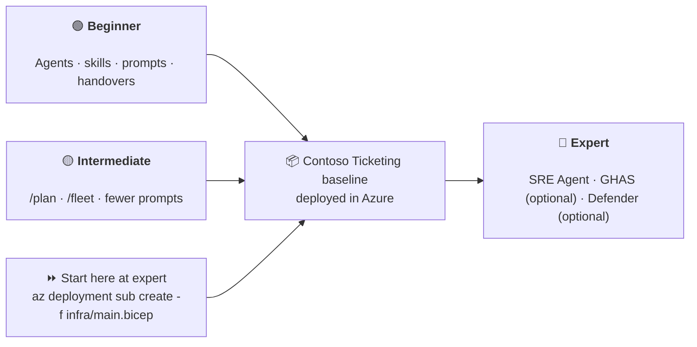
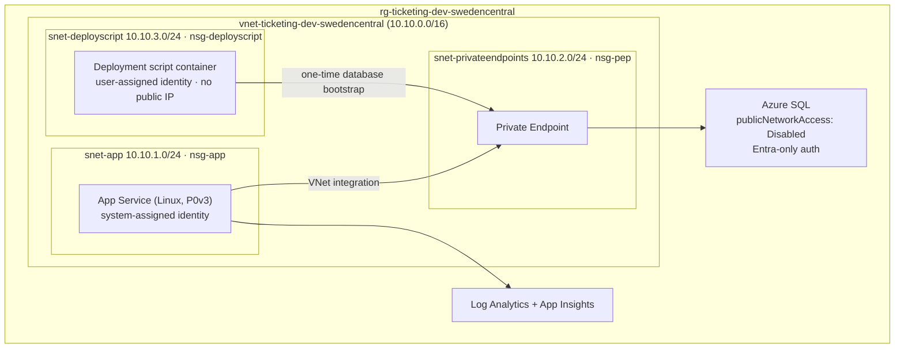

# Agentic Engineering on Azure Infrastructure — Hackathon

> **One hackathon. One workload. Three levels of maturity.**
>
> Every track designs, builds and deploys the **same** Azure workload — the *Contoso Ticketing* platform.
> What changes per level is **how agentically** you get there.

---

## The Idea

| Level | You learn | You still deliver |
|---|---|---|
| 🟢 **Beginner** | The building blocks: **agents, skills, prompts and handovers** | The Contoso Ticketing baseline, deployed |
| 🟡 **Intermediate** | Do the same thing in **far fewer prompts** using the latest Copilot features (`/plan`, `/fleet`, custom agents, subagents) | The same baseline, deployed |
| 🔴 **Expert** | Architect → plan → test → build → deploy → document **plus** day-2: **Azure SRE Agent** for desired state & reliability, and *(optional)* **GHAS + Defender for Cloud** for code-to-cloud security | The same baseline, deployed, self-healing and — if you run the optional labs — secured code-to-cloud |

Because all three tracks land on the identical baseline, **a team that finishes beginner or intermediate can roll straight into the expert track** — their own deployment becomes the expert track's starting point. Teams that start at expert deploy the reference baseline in `infra/` in one command and go straight to day-2.



---

## The Workload — Contoso Ticketing

A small but realistic, secure-by-default Azure workload. Reference implementation lives in [`infra/`](infra/).



On top of it runs [`src/ContosoTicketing`](src/ContosoTicketing/) — a minimal .NET 8 API exposing
`/healthz`, `/readyz` and `/api/tickets`. Every track deploys the **same** infrastructure *and* the
**same** application, which is what lets the expert labs break, scan and fix your own deployment.
See [the fault and vulnerability contract](docs/concepts/fault-and-vulnerability.md).

**Non-negotiable standards** (all tracks are graded on these):

- Bicep with version-pinned **Azure Verified Modules**, CAF naming `<type>-<workload>-<env>-<region>`, tags `environment`, `workload`, `owner`, `costCenter`
- No public database access — Private Endpoint + private DNS only
- Managed identity everywhere — **no passwords, no connection-string secrets**
- NSGs with an explicit deny-all rule, TLS 1.2+, HTTPS only
- A private, VNet-integrated deployment script container for the one-time private SQL bootstrap — no VM, Bastion or Key Vault secret
- Diagnostics wired into Log Analytics

See [`docs/concepts/workload.md`](docs/concepts/workload.md) for the full specification and acceptance criteria.

---

## Indicative cost for one day

These are **planning ranges**, not a quote: prices vary by region, agreement, usage and telemetry
volume. They assume the supplied `swedencentral` baseline runs for 24 consecutive hours: one
always-on Linux P0v3 App Service plan, a 0.5-vCore minimum General Purpose serverless SQL database,
private networking (private endpoint and private DNS zone), and low-volume Azure Monitor ingestion.
The database can pause after 60 minutes of inactivity, but the App Service plan cannot. The database
bootstrap runs as a short-lived VNet-integrated deployment script (a container instance plus a small
Standard_LRS storage account), which costs cents per deployment rather than per day.

| Track | Estimated Azure cost / 24 h | Assumption |
|---|---:|---|
| 🟢 Beginner | **€4–€8** | Shared baseline |
| 🟡 Intermediate | **€4–€8** | Same shared baseline |
| 🔴 Expert | **€6–€13** | Baseline plus the Defender plans used in the optional Lab 6 |

GHAS licensing is a GitHub entitlement and is **not** included; Labs 5 and 6 are optional precisely
because of this. Alerting, Application Insights
ingestion, availability tests and Defender can increase the total. Before deploying, price your
selected region and currency in the [Azure Pricing Calculator](https://azure.microsoft.com/pricing/calculator/);
after the exercise, delete the resource group and disable any Defender plans created in the optional Lab 6.

---

## Prerequisites

- A **fork** of this repository in your own GitHub account or organisation, and an Azure subscription
  assigned to your team. Do not deploy into the shared upstream subscription.
- Beginner/intermediate: a scope where your team can create the baseline resources. Expert: also
  `User Access Administrator`, permission to enable Defender plans, and repository-admin access.
  Defender (Lab 6) and GHAS (Lab 5) are **optional day-2 lanes** of the expert track — see
  [Optional labs](#optional-labs-ghas--defender-for-cloud) below.
- **GitHub Copilot** licence for every team member. The optional GHAS lab additionally needs an
  Enterprise/GHAS-enabled repository (GitHub Advanced Security is a paid entitlement — confirm your
  organisation's licence before starting Lab 5).
- A place to run these steps: **Codespaces/local VS Code with the dev container**, **local VS Code
  without the dev container**, or **Azure Cloud Shell** all work — see
  [Execution Environments](docs/concepts/environment-options.md) for what each option gives you and
  where each step in the tracks should run. The examples use Bash; native Windows users should use
  the dev container or Cloud Shell.

### Tooling and versions

| Tool | Version needed | Already in the dev container? | How to configure it yourself |
|---|---|---|---|
| **Git** | any recent version | ✅ (image default) | Install from [git-scm.com](https://git-scm.com/downloads); run `git --version` to check |
| **GitHub account + Codespaces access** | — | n/a | Codespaces is enabled by default for personal accounts; for an organisation, an owner enables it under **Organisation → Settings → Codespaces → Enable for members**. Confirm you can click **Code → Codespaces → Create codespace** on your fork |
| **GitHub Copilot** | active Business/Enterprise or Individual licence | n/a | Assigned by your GitHub organisation admin (**Settings → Copilot → Access**), or via an individual subscription at [github.com/settings/copilot](https://github.com/settings/copilot). Verify with the Copilot Chat icon in VS Code — sign in with **Accounts → Sign in to use Copilot** if it is greyed out |
| **VS Code** | latest stable | n/a (Codespaces runs it in-browser or via the desktop app) | Install from [code.visualstudio.com](https://code.visualstudio.com/); the dev container installs the required extensions (`GitHub.copilot`, `GitHub.copilot-chat`, `ms-azuretools.vscode-bicep`) automatically — see [`.devcontainer/devcontainer.json`](.devcontainer/devcontainer.json) |
| **Azure CLI** | 2.60+ | ✅ (`ghcr.io/devcontainers/features/azure-cli`) | Install per [the official docs](https://learn.microsoft.com/cli/azure/install-azure-cli); check with `az --version` |
| **Bicep CLI** | 0.30+ (bundled with Azure CLI) | ✅ (installed via `az bicep install` in `postCreateCommand`) | Run `az bicep install` then `az bicep upgrade`; check with `az bicep version` |
| **.NET SDK** | **8.0** (matches [`ContosoTicketing.csproj`](src/ContosoTicketing/ContosoTicketing.csproj) `net8.0` target) | ✅ (`ghcr.io/devcontainers/features/dotnet:2`, version `8.0`) | Install the [.NET 8 SDK](https://dotnet.microsoft.com/download/dotnet/8.0); check with `dotnet --version` (must report `8.x`) — a mismatched SDK will fail `dotnet build src/ContosoTicketing` |
| **Node.js** | LTS (used by tooling in `.vscode`/CI, not the app itself) | ✅ (`ghcr.io/devcontainers/features/node`, `lts`) | Install via [nvm](https://github.com/nvm-sh/nvm) or [nodejs.org](https://nodejs.org/); check with `node --version` |
| **GitHub CLI (`gh`)** | latest | ✅ (`ghcr.io/devcontainers/features/github-cli`) | Install per [cli.github.com](https://cli.github.com/); run `gh auth login` and confirm with `gh auth status` before Labs 1 and 5, which use `gh api` |

Using **Codespaces** (recommended, zero local install): open your fork on GitHub, click
**Code → Codespaces → Create codespace on main**. This builds
[`.devcontainer/devcontainer.json`](.devcontainer/devcontainer.json) for you, which already pins the
versions above and pre-installs the Copilot/Bicep VS Code extensions and the `.vscode/mcp.json` MCP
servers — no manual tool installation needed. If you instead open the repo in **local VS Code**, use
**Dev Containers: Reopen in Container** to get the same environment, or install each tool from the
table above yourself if you skip the dev container entirely. See
[Execution Environments](docs/concepts/environment-options.md) for the full comparison.

- Deploy in a region where the **Azure SRE Agent** is available if you intend to do the expert track: `swedencentral`, `eastus2` or `australiaeast`

### Sign in

```bash
az login
az account show --query "{name:name, id:id, tenantId:tenantId}" -o table
gh auth login
gh auth status
```

> Confirm the subscription and tenant with your coaches before deploying anything.

### Optional labs: GHAS & Defender for Cloud

The expert track's **Lab 5 (GHAS)** and **Lab 6 (Defender for Cloud)** are **optional**: they need
entitlements this hackathon does not provide (GHAS licensing, Defender plan spend) and are not a
prerequisite for Labs 1–4 or 7. Teams without a GHAS-enabled repository or without permission/budget
to enable Defender plans can skip straight from Lab 4 to Lab 7 and adapt its feedback-loop exercise
to the reliability lane only. See [the expert track guide](docs/tracks/expert.md#labs) for how the
optional labs fit into the sequence.

---

## Quick Start Beginner and Intermediate Track

Choose the option that fits your team — full details and a step-by-step "where to run what" table
are in [Execution Environments](docs/concepts/environment-options.md):

- **Codespaces or local VS Code with the dev container** (recommended — gets you agents, prompts,
  Copilot Chat and pre-installed tooling in one step):

  ```bash
  git clone https://github.com/<your-account>/AgenticEngineering-Hackathon-Infrastructure.git
  cd AgenticEngineering-Hackathon-Infrastructure
  code .
  ```

  In VS Code, choose **Dev Containers: Reopen in Container** (or open the clone directly in a
  Codespace). The devcontainer installs Azure CLI, Bicep and the Bicep extension; install and
  authenticate Copilot CLI separately if you take the intermediate track.

- **Local VS Code without the dev container**: clone and open the repo as above but skip "Reopen in
  Container". You are responsible for installing Azure CLI, Bicep and the .NET SDK yourself.

- **Azure Cloud Shell**: open [shell.azure.com](https://shell.azure.com) or the Cloud Shell icon in
  the Azure Portal. Bash, Azure CLI and Bicep are already installed, but there is no Copilot Chat —
  use it for running `az`/Bicep/`dotnet` commands after writing your agents and prompts elsewhere.

Then choose your track, open its guide, and execute the hackathon steps for that track.

Before any deployment, edit `infra/main.bicepparam`:

- Choose a unique `workload` and `environment` token so your resource names cannot collide with another team
- Set the `owner` and `costCenter` tag values for your team
- Optionally change `location` — use `swedencentral`, `eastus2` or `australiaeast` if you intend to do the expert track

There is nothing else to prepare: the Microsoft Entra SQL administrator is a user-assigned managed
identity created by the deployment itself, and the database bootstrap runs automatically as a
VNet-integrated deployment script. No SQL administrator group, password, SSH key or Key Vault
secret is required — see [the operations runbook](docs/operations-runbook.md#bootstrap-sql-access).

---

## Choose Your Track

| | 🟢 Beginner | 🟡 Intermediate | 🔴 Expert |
|---|---|---|---|
| **Duration** | ~3 h 45 min | ~3 h 45 min | ~4 h as a team; ~6 h solo |
| **Prereq** | Copilot basics | Beginner track or equivalent | A deployed baseline |
| **Focus** | Build the agentic pipeline by hand | Compress it with modern Copilot | Day-2 reliability + security |
| **Guide** | [docs/tracks/beginner.md](docs/tracks/beginner.md) | [docs/tracks/intermediate.md](docs/tracks/intermediate.md) | [docs/tracks/expert.md](docs/tracks/expert.md) |

Not sure? Start at [docs/tracks/README.md](docs/tracks/README.md).

Starting fresh at expert? The one-command baseline deployment, the application publish and the SQL
bootstrap are documented in [docs/tracks/expert.md](docs/tracks/expert.md#start-here).

---

## Track Validation 

After completing the track work, run validation:

```bash
./scripts/validate-infra.sh
dotnet build src/ContosoTicketing
```
---

## What's in This Repo

```
.
├── .devcontainer/devcontainer.json      # Codespaces-ready environment
├── .github/
│   ├── agents/                          # 📖 Reference agents (architect → sre)
│   ├── prompts/                         # 📖 Reference prompts, numbered per track
│   ├── instructions/                    # 🤖 Auto-activating Copilot guidelines
│   ├── workflows/infra-ci.yml           # Bicep build + lint on every PR
│   ├── workflows/app-ci.yml             # .NET build, CodeQL and dependency review
│   ├── codeql-config.yml                 # CodeQL scope and security query suite
│   ├── dependabot.yml                    # NuGet and GitHub Actions updates
│   └── copilot-instructions.md          # Workspace-wide Copilot context
├── .vscode/mcp.json                     # Azure, Learn and GitHub MCP servers
├── docs/
│   ├── tracks/{beginner,intermediate,expert}.md
│   ├── concepts/                        # Workload spec, agent anatomy, handovers, fault & vulnerability contract, execution environments
│   └── expert/                          # SRE Agent + GHAS/Defender labs (GHAS/Defender optional)
├── infra/                               # 📦 The shared Contoso Ticketing baseline
│   ├── main.bicep · main.bicepparam
│   └── modules/{networking,database,database-bootstrap,identity-app,identity-bootstrap,webapp,monitoring,alerts}.bicep
├── knowledge/                           # Azure SRE Agent architecture, runbook and escalation policy
├── src/ContosoTicketing/                # 📦 The shared .NET 8 application
└── scripts/{validate-infra.sh, bootstrap-ticketing-database-deploymentscript.sh}
```

---

## Credits & Related Repos

This hackathon deliberately builds on existing material:

| Source | Used for |
|---|---|
| [pascalvanderheiden/code-under-construction-hackathon](https://github.com/pascalvanderheiden/code-under-construction-hackathon) — Use Case 1 (IaC) | The beginner track's agentic IaC pipeline |
| [JoranBergfeld/sre-agent-workshop](https://github.com/JoranBergfeld/sre-agent-workshop) | The expert track's Azure SRE Agent labs |
| [JoranBergfeld/ghas-defender-example](https://github.com/JoranBergfeld/ghas-defender-example) | The expert track's GHAS + Defender for Cloud labs |

## License

[MIT](LICENSE)
