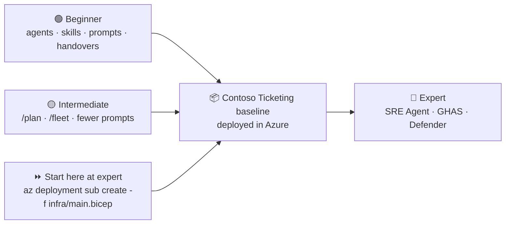
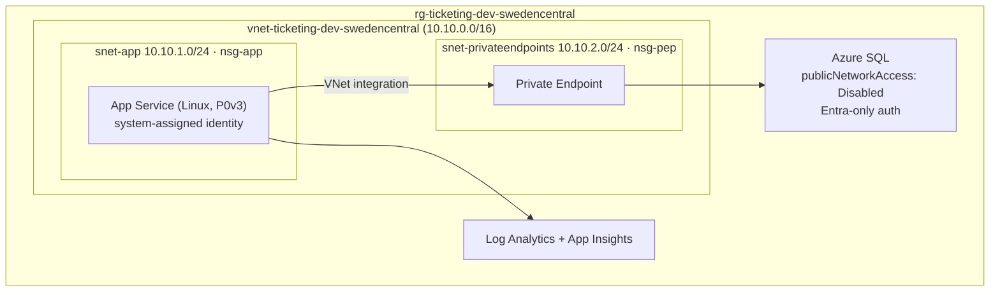

# Agentic Engineering on Azure Infrastructure — Hackathon

> **One hackathon. One workload. Three levels of maturity.**
>
> Every track designs, builds and deploys the **same** Azure workload — the *Contoso Ticketing* platform.
> What changes per level is **how agentically** you get there.

---

## The Idea

| Level | You learn | You still deliver |
|---|---|---|
| 🟢 **Beginner** | The building blocks: **agents, skills, prompts and handovers** | The Contoso Ticketing baseline, deployed |
| 🟡 **Intermediate** | Do the same thing in **far fewer prompts** using the latest Copilot features (`/plan`, `/fleet`, custom agents, subagents) | The same baseline, deployed |
| 🔴 **Expert** | Architect → plan → test → build → deploy → document **plus** day-2: **Azure SRE Agent** for desired state & reliability, and **GHAS + Defender for Cloud** for code-to-cloud security | The same baseline, deployed, self-healing and secured |

Because all three tracks land on the identical baseline, **a team that finishes beginner or intermediate can roll straight into the expert track** — their own deployment becomes the expert track's starting point. Teams that start at expert deploy the reference baseline in `infra/` in one command and go straight to day-2.



---

## The Workload — Contoso Ticketing

A small but realistic, secure-by-default Azure workload. Reference implementation lives in [`infra/`](infra/).



On top of it runs [`src/ContosoTicketing`](src/ContosoTicketing/) — a minimal .NET 8 API exposing
`/healthz`, `/readyz` and `/api/tickets`. Every track deploys the **same** infrastructure *and* the
**same** application, which is what lets the expert labs break, scan and fix your own deployment.
See [the fault and vulnerability contract](docs/concepts/fault-and-vulnerability.md).

**Non-negotiable standards** (all tracks are graded on these):

- Bicep with version-pinned **Azure Verified Modules**, CAF naming `<type>-<workload>-<env>-<region>`, tags `environment`, `workload`, `owner`, `costCenter`
- No public database access — Private Endpoint + private DNS only
- Managed identity everywhere — **no passwords, no connection-string secrets**
- NSGs with an explicit deny-all rule, TLS 1.2+, HTTPS only
- Diagnostics wired into Log Analytics

See [`docs/concepts/workload.md`](docs/concepts/workload.md) for the full specification and acceptance criteria.

---

## Choose Your Track

| | 🟢 Beginner | 🟡 Intermediate | 🔴 Expert |
|---|---|---|---|
| **Duration** | ~4 h | ~4 h | ~6 h |
| **Prereq** | Copilot basics | Beginner track or equivalent | A deployed baseline |
| **Focus** | Build the agentic pipeline by hand | Compress it with modern Copilot | Day-2 reliability + security |
| **Guide** | [docs/tracks/beginner.md](docs/tracks/beginner.md) | [docs/tracks/intermediate.md](docs/tracks/intermediate.md) | [docs/tracks/expert.md](docs/tracks/expert.md) |

Not sure? Start at [docs/tracks/README.md](docs/tracks/README.md).

---

## Prerequisites

- **Azure subscription** with `Contributor` **and** `User Access Administrator` (the expert track assigns roles and enables Defender plans)
- **GitHub Copilot** licence — Business or Enterprise (the expert track needs GHAS, so an **Enterprise/GHAS-enabled** repo)
- **VS Code** or **GitHub Codespaces** with Copilot + Copilot Chat
- **Azure CLI** with Bicep (`az bicep install`)
- Deploy in a region where the **Azure SRE Agent** is available if you intend to do the expert track: `swedencentral`, `eastus2` or `australiaeast`

### Sign in

```bash
az login
az account show --query "{name:name, id:id, tenantId:tenantId}" -o table
```

> Confirm the subscription and tenant with your coaches before deploying anything.

---

## Quick Start

```bash
git clone https://github.com/bram-boer-org/AgenticEngineering-Hackathon-Infrastructure.git
cd AgenticEngineering-Hackathon-Infrastructure
code .
```

Open in Codespaces or VS Code — the devcontainer installs Azure CLI, Bicep and the Bicep extension.

Then open the guide for your track and follow it. To validate any Bicep you (or your agents) write:

```bash
./scripts/validate-infra.sh
dotnet build src/ContosoTicketing
```

To deploy the reference baseline directly (expert fast-start):

```bash
az deployment sub create \
  --name ticketing-baseline \
  --location swedencentral \
  --template-file infra/main.bicep \
  --parameters infra/main.bicepparam
```

From a private-network-connected host, run the idempotent SQL bootstrap as the configured Microsoft
Entra SQL administrator. It creates the managed-identity user, its `db_datareader` grant and
`dbo.Tickets` without enabling public SQL access:

```bash
./scripts/bootstrap-ticketing-database.sh --deployment-name ticketing-baseline
```

---

## What's in This Repo

```
.
├── .devcontainer/devcontainer.json      # Codespaces-ready environment
├── .github/
│   ├── agents/                          # 📖 Reference agents (architect → sre)
│   ├── prompts/                         # 📖 Reference prompts, numbered per track
│   ├── instructions/                    # 🤖 Auto-activating Copilot guidelines
│   ├── workflows/infra-ci.yml           # Bicep build + lint on every PR
│   ├── workflows/app-ci.yml             # dotnet build on every PR; CodeQL target in Lab 5
│   └── copilot-instructions.md          # Workspace-wide Copilot context
├── .vscode/mcp.json                     # Azure, Learn and GitHub MCP servers
├── docs/
│   ├── tracks/{beginner,intermediate,expert}.md
│   ├── concepts/                        # Workload spec, agent anatomy, handovers, fault & vulnerability contract
│   └── expert/                          # SRE Agent + GHAS/Defender labs
├── infra/                               # 📦 The shared Contoso Ticketing baseline
│   ├── main.bicep · main.bicepparam
│   └── modules/{networking,database,webapp,monitoring}.bicep
├── src/ContosoTicketing/                # 📦 The shared .NET 8 application
└── scripts/validate-infra.sh
```

---

## Credits & Related Repos

This hackathon deliberately builds on existing material:

| Source | Used for |
|---|---|
| [bram-boer/code-under-construction-hackathon](https://github.com/bram-boer/code-under-construction-hackathon) — Use Case 1 (IaC) | The beginner track's agentic IaC pipeline |
| [JoranBergfeld/sre-agent-workshop](https://github.com/JoranBergfeld/sre-agent-workshop) | The expert track's Azure SRE Agent labs |
| [JoranBergfeld/ghas-defender-example](https://github.com/JoranBergfeld/ghas-defender-example) | The expert track's GHAS + Defender for Cloud labs |

## License

[MIT](LICENSE)
