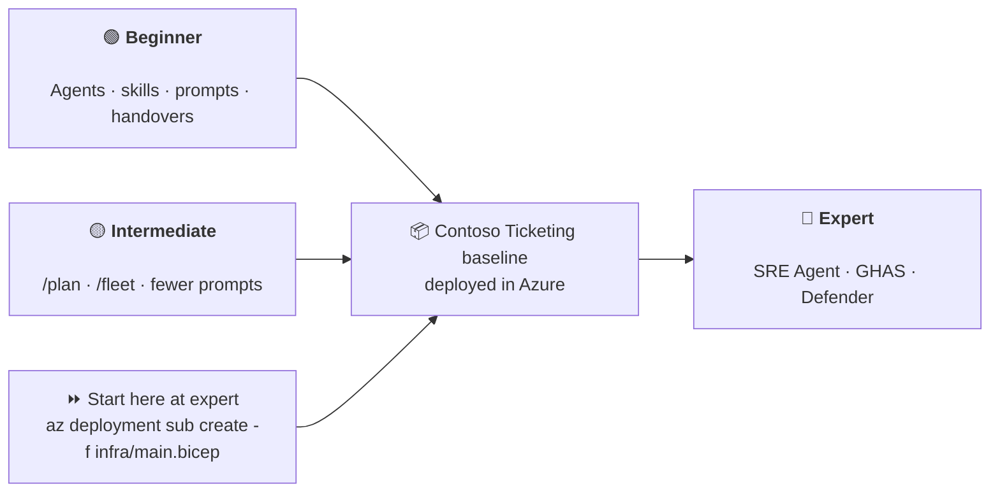
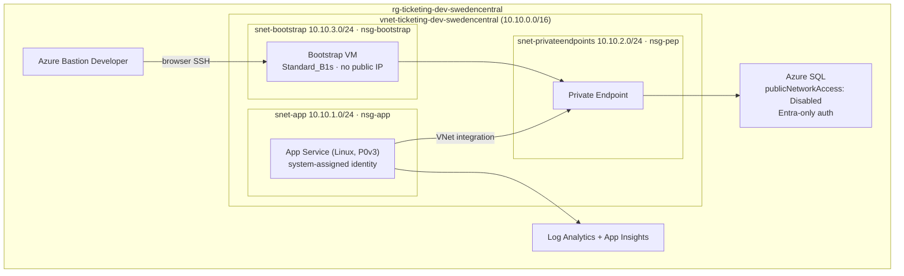

# Agentic Engineering on Azure Infrastructure — Hackathon

> **One hackathon. One workload. Three levels of maturity.**
>
> Every track designs, builds and deploys the **same** Azure workload — the *Contoso Ticketing* platform.
> What changes per level is **how agentically** you get there.

---

## The Idea

| Level | You learn | You still deliver |
|---|---|---|
| 🟢 **Beginner** | The building blocks: **agents, skills, prompts and handovers** | The Contoso Ticketing baseline, deployed |
| 🟡 **Intermediate** | Do the same thing in **far fewer prompts** using the latest Copilot features (`/plan`, `/fleet`, custom agents, subagents) | The same baseline, deployed |
| 🔴 **Expert** | Architect → plan → test → build → deploy → document **plus** day-2: **Azure SRE Agent** for desired state & reliability, and **GHAS + Defender for Cloud** for code-to-cloud security | The same baseline, deployed, self-healing and secured |

Because all three tracks land on the identical baseline, **a team that finishes beginner or intermediate can roll straight into the expert track** — their own deployment becomes the expert track's starting point. Teams that start at expert deploy the reference baseline in `infra/` in one command and go straight to day-2.



---

## The Workload — Contoso Ticketing

A small but realistic, secure-by-default Azure workload. Reference implementation lives in [`infra/`](infra/).



On top of it runs [`src/ContosoTicketing`](src/ContosoTicketing/) — a minimal .NET 8 API exposing
`/healthz`, `/readyz` and `/api/tickets`. Every track deploys the **same** infrastructure *and* the
**same** application, which is what lets the expert labs break, scan and fix your own deployment.
See [the fault and vulnerability contract](docs/concepts/fault-and-vulnerability.md).

**Non-negotiable standards** (all tracks are graded on these):

- Bicep with version-pinned **Azure Verified Modules**, CAF naming `<type>-<workload>-<env>-<region>`, tags `environment`, `workload`, `owner`, `costCenter`
- No public database access — Private Endpoint + private DNS only
- Managed identity everywhere — **no passwords, no connection-string secrets**
- NSGs with an explicit deny-all rule, TLS 1.2+, HTTPS only
- A private burstable bootstrap VM with Azure Bastion Developer for the one-time private SQL bootstrap
- Diagnostics wired into Log Analytics

See [`docs/concepts/workload.md`](docs/concepts/workload.md) for the full specification and acceptance criteria.

---

## Indicative cost for one day

These are **planning ranges**, not a quote: prices vary by region, agreement, usage and telemetry
volume. They assume the supplied `swedencentral` baseline runs for 24 consecutive hours: one
always-on Linux P0v3 App Service plan, a 0.5-vCore minimum General Purpose serverless SQL database,
private networking, a burstable Standard_B1s bootstrap VM, free Azure Bastion Developer, and
low-volume Azure Monitor ingestion. The database can pause after 60 minutes of inactivity, but the
App Service plan cannot.

| Track | Estimated Azure cost / 24 h | Assumption |
|---|---:|---|
| 🟢 Beginner | **€5–€9** | Shared baseline, including bootstrap VM |
| 🟡 Intermediate | **€5–€9** | Same shared baseline |
| 🔴 Expert | **€7–€14** | Baseline plus the Defender plans used in Lab 6 |

GHAS licensing is a GitHub entitlement and is **not** included. Alerting, Application Insights
ingestion, availability tests and Defender can increase the total. Before deploying, price your
selected region and currency in the [Azure Pricing Calculator](https://azure.microsoft.com/pricing/calculator/);
after the exercise, delete the resource group and disable any Defender plans created in Lab 6.

---

## Prerequisites

- A **fork** of this repository in your own GitHub account or organisation, and an Azure subscription
  assigned to your team. Do not deploy into the shared upstream subscription.
- Beginner/intermediate: a scope where your team can create the baseline resources. Expert: also
  `User Access Administrator`, permission to enable Defender plans, and repository-admin access.
- **GitHub Copilot** licence. Expert additionally needs an Enterprise/GHAS-enabled repository.
- A place to run these steps: **Codespaces/local VS Code with the dev container**, **local VS Code
  without the dev container**, or **Azure Cloud Shell** all work — see
  [Execution Environments](docs/concepts/environment-options.md) for what each option gives you and
  where each step in the tracks should run. The examples use Bash; native Windows users should use
  the dev container or Cloud Shell.
- **Azure CLI** with Bicep (`az bicep install`)
- Deploy in a region where the **Azure SRE Agent** is available if you intend to do the expert track: `swedencentral`, `eastus2` or `australiaeast`

### Sign in

```bash
az login
az account show --query "{name:name, id:id, tenantId:tenantId}" -o table
```

> Confirm the subscription and tenant with your coaches before deploying anything.

---

## Quick Start Beginner and Intermediate Track

Choose the option that fits your team — full details and a step-by-step "where to run what" table
are in [Execution Environments](docs/concepts/environment-options.md):

- **Codespaces or local VS Code with the dev container** (recommended — gets you agents, prompts,
  Copilot Chat and pre-installed tooling in one step):

  ```bash
  git clone https://github.com/<your-account>/AgenticEngineering-Hackathon-Infrastructure.git
  cd AgenticEngineering-Hackathon-Infrastructure
  code .
  ```

  In VS Code, choose **Dev Containers: Reopen in Container** (or open the clone directly in a
  Codespace). The devcontainer installs Azure CLI, Bicep and the Bicep extension; install and
  authenticate Copilot CLI separately if you take the intermediate track.

- **Local VS Code without the dev container**: clone and open the repo as above but skip "Reopen in
  Container". You are responsible for installing Azure CLI, Bicep and the .NET SDK yourself.

- **Azure Cloud Shell**: open [shell.azure.com](https://shell.azure.com) or the Cloud Shell icon in
  the Azure Portal. Bash, Azure CLI and Bicep are already installed, but there is no Copilot Chat —
  use it for running `az`/Bicep/`dotnet` commands after writing your agents and prompts elsewhere.

Then choose your track, open its guide, and execute the hackathon steps for that track.

Before any deployment, edit `infra/main.bicepparam`: 
- Choose a unique `workload` and `environment` token so your resource names cannot collide with another team
- Replace the placeholder SQL administrator values with a Microsoft Entra group or user from **your** tenant. The supplied
example uses the `sg-hackathon-sqladmins` group. Reuse that group if it already exists, or create
it if your tenant permits group creation:

```bash
az ad group create \
  --display-name "sg-hackathon-sqladmins" \
  --mail-nickname "sg-hackathon-sqladmins"
```

Then retrieve the group's values and copy them into `sqlAdminObjectId` and `sqlAdminLogin`:

```bash
az ad group show --group "sg-hackathon-sqladmins" \
  --query "{objectId:id, login:displayName}" -o table
```

- Generate an SSH key with `ssh-keygen -t ed25519 -f ~/.ssh/ticketing-bootstrap` and copy the
  public-key contents into `bootstrapVmSshPublicKey`. Keep the matching private key outside source
  control; after the baseline deploys, upload it to the resource group's Key Vault as the secret
  `bootstrap-vm-ssh-private-key` and select that secret when you open the VM through Azure Bastion
  Developer.

---

## Choose Your Track

| | 🟢 Beginner | 🟡 Intermediate | 🔴 Expert |
|---|---|---|---|
| **Duration** | ~3 h 45 min | ~3 h 45 min | ~4 h as a team; ~6 h solo |
| **Prereq** | Copilot basics | Beginner track or equivalent | A deployed baseline |
| **Focus** | Build the agentic pipeline by hand | Compress it with modern Copilot | Day-2 reliability + security |
| **Guide** | [docs/tracks/beginner.md](docs/tracks/beginner.md) | [docs/tracks/intermediate.md](docs/tracks/intermediate.md) | [docs/tracks/expert.md](docs/tracks/expert.md) |

Not sure? Start at [docs/tracks/README.md](docs/tracks/README.md).

Starting fresh at expert? The one-command baseline deployment, the application publish and the SQL
bootstrap are documented in [docs/tracks/expert.md](docs/tracks/expert.md#start-here).

---

## Track Validation 

After completing the track work, run validation:

```bash
./scripts/validate-infra.sh
dotnet build src/ContosoTicketing
```
---

## What's in This Repo

```
.
├── .devcontainer/devcontainer.json      # Codespaces-ready environment
├── .github/
│   ├── agents/                          # 📖 Reference agents (architect → sre)
│   ├── prompts/                         # 📖 Reference prompts, numbered per track
│   ├── instructions/                    # 🤖 Auto-activating Copilot guidelines
│   ├── workflows/infra-ci.yml           # Bicep build + lint on every PR
│   ├── workflows/app-ci.yml             # .NET build, CodeQL and dependency review
│   ├── codeql-config.yml                 # CodeQL scope and security query suite
│   ├── dependabot.yml                    # NuGet and GitHub Actions updates
│   └── copilot-instructions.md          # Workspace-wide Copilot context
├── .vscode/mcp.json                     # Azure, Learn and GitHub MCP servers
├── docs/
│   ├── tracks/{beginner,intermediate,expert}.md
│   ├── concepts/                        # Workload spec, agent anatomy, handovers, fault & vulnerability contract, execution environments
│   └── expert/                          # SRE Agent + GHAS/Defender labs
├── infra/                               # 📦 The shared Contoso Ticketing baseline
│   ├── main.bicep · main.bicepparam
│   └── modules/{networking,database,webapp,monitoring,alerts}.bicep
├── knowledge/                           # Azure SRE Agent architecture, runbook and escalation policy
├── src/ContosoTicketing/                # 📦 The shared .NET 8 application
└── scripts/validate-infra.sh
```

---

## Credits & Related Repos

This hackathon deliberately builds on existing material:

| Source | Used for |
|---|---|
| [pascalvanderheiden/code-under-construction-hackathon](https://github.com/pascalvanderheiden/code-under-construction-hackathon) — Use Case 1 (IaC) | The beginner track's agentic IaC pipeline |
| [JoranBergfeld/sre-agent-workshop](https://github.com/JoranBergfeld/sre-agent-workshop) | The expert track's Azure SRE Agent labs |
| [JoranBergfeld/ghas-defender-example](https://github.com/JoranBergfeld/ghas-defender-example) | The expert track's GHAS + Defender for Cloud labs |

## License

[MIT](LICENSE)
