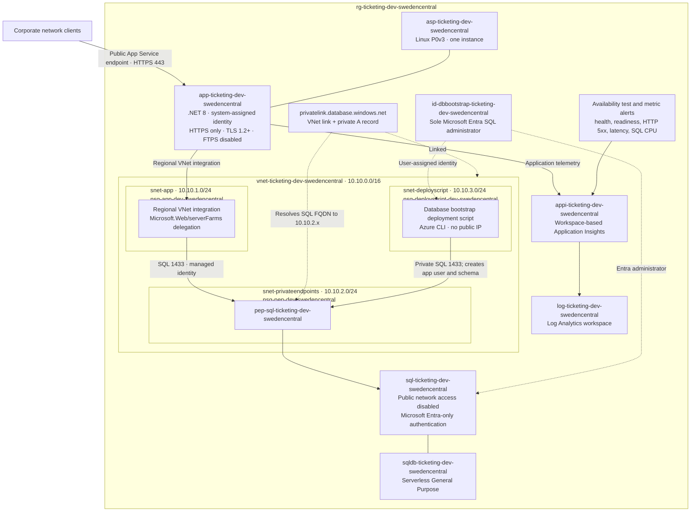

# Contoso Ticketing Target Architecture

This document is the architecture contract for the Contoso Ticketing baseline. The authoritative
requirements are in [The Shared Workload](concepts/workload.md); owner-approved choices are recorded
under [Resolved decisions](#resolved-decisions).

The baseline values shown below are `workload=ticketing`, `environment=dev`, and
`region=swedencentral`. Reusable assets retain parameters for those values. Every taggable resource,
including the resource group, carries `environment`, `workload`, `owner`, and `costCenter`.

## Target architecture

The App Service uses outbound regional VNet integration; it is not hosted inside `snet-app`. The SQL
logical server has no public data path. Both the application and the private bootstrap resolve and
reach SQL through the private endpoint.

## Resource table

Module versions below are the exact versions validated by the repository reference implementation.
Native resource API versions used inside modules must also be explicit. No module or API version may
use `latest`.

| Purpose | Azure resource type | CAF name | SKU or configuration | Reason |
|---|---|---|---|---|
| Workload lifecycle boundary | `Microsoft.Resources/resourceGroups` | `rg-ticketing-dev-swedencentral` | n/a | Isolates the environment for deployment, access control, cost, and cleanup. |
| Network boundary | `Microsoft.Network/virtualNetworks` | `vnet-ticketing-dev-swedencentral` | `10.10.0.0/16`; AVM `0.10.0` | The required address space leaves room for the three baseline /24 subnets and later expansion. |
| App outbound integration | `Microsoft.Network/virtualNetworks/subnets` | `snet-app` | `10.10.1.0/24`; delegated to `Microsoft.Web/serverFarms` | Provides private outbound routing and DNS resolution for App Service. |
| SQL private-link hosting | `Microsoft.Network/virtualNetworks/subnets` | `snet-privateendpoints` | `10.10.2.0/24` | Separates private endpoint traffic from compute integration. |
| Private bootstrap hosting | `Microsoft.Network/virtualNetworks/subnets` | `snet-deployscript` | `10.10.3.0/24`; delegated to `Microsoft.ContainerInstance/containerGroups` | Lets the deployment script container run without a public IP. |
| App subnet filtering | `Microsoft.Network/networkSecurityGroups` | `nsg-app-dev-swedencentral` | AVM `0.5.3` | Allows only required flows and ends with explicit deny-all inbound at priority 4096. |
| Private endpoint filtering | `Microsoft.Network/networkSecurityGroups` | `nsg-pep-dev-swedencentral` | AVM `0.5.3` | Permits required private SQL traffic and ends with explicit deny-all inbound at priority 4096. |
| Bootstrap subnet filtering | `Microsoft.Network/networkSecurityGroups` | `nsg-deployscript-dev-swedencentral` | AVM `0.5.3` | Permits only bootstrap dependencies and ends with explicit deny-all inbound at priority 4096. |
| Compute capacity | `Microsoft.Web/serverfarms` | `asp-ticketing-dev-swedencentral` | Linux `P0v3`, capacity 1; AVM `0.7.0` | The workload explicitly fixes the smallest Premium v3 baseline; one instance limits development cost. |
| Ticketing API | `Microsoft.Web/sites` | `app-ticketing-dev-swedencentral` | Linux `.NET 8`; AVM `0.24.0` | Runs the required API routes and supports health checks, managed identity, TLS controls, and VNet integration. |
| SQL host | `Microsoft.Sql/servers` | `sql-ticketing-dev-swedencentral` | Entra-only, TLS 1.2 minimum, public access disabled; AVM `0.22.0` | Provides the managed relational service while removing internet reachability and SQL-password authentication. |
| Ticket data | `Microsoft.Sql/servers/databases` | `sqldb-ticketing-dev-swedencentral` | `GP_S_Gen5`, 1 vCore, minimum 0.5 vCore, 60-minute auto-pause | Serverless General Purpose fits an intermittent internal development workload and reduces idle compute cost. |
| Private SQL access | `Microsoft.Network/privateEndpoints` | `pep-sql-ticketing-dev-swedencentral` | SQL server subresource | Makes private link the only SQL network path. |
| Private SQL name resolution | `Microsoft.Network/privateDnsZones` | `privatelink.database.windows.net` | AVM `0.8.1` | Resolves the normal SQL FQDN to the private endpoint address from the workload VNet. |
| Database bootstrap identity | `Microsoft.ManagedIdentity/userAssignedIdentities` | `id-dbbootstrap-ticketing-dev-swedencentral` | AVM `0.6.0` | Gives the private deployment script a stable identity and serves as the sole Entra SQL administrator. |
| Idempotent database bootstrap | `Microsoft.Resources/deploymentScripts` | `script-dbbootstrap-ticketing-dev-swedencentral` | Azure CLI; AVM `0.5.2`; `OnExpiration`, `P1D` | Creates the app contained user and `Tickets` schema privately while retaining failed-run logs for one day. |
| Bootstrap scratch storage | `Microsoft.Storage/storageAccounts` | `stticketdev<hash6>` | `Standard_LRS`; AVM `0.33.0` | Supports the deployment script at lowest local-redundancy cost. Because storage names are globally scoped, prohibit hyphens, and allow at most 24 characters, append the first six characters of a deterministic `uniqueString` derived from deployment inputs. |
| Central telemetry store | `Microsoft.OperationalInsights/workspaces` | `log-ticketing-dev-swedencentral` | `PerGB2018`, 30-day retention, no daily cap; AVM `0.16.1` | Provides consumption-based ingestion and the required workspace backing for Application Insights. |
| Application telemetry | `Microsoft.Insights/components` | `appi-ticketing-dev-swedencentral` | Workspace-based, default sampling; AVM `0.8.0` | Correlates requests, dependencies, exceptions, and readiness behavior with central logs. |
| End-to-end readiness probe | `Microsoft.Insights/webtests` | `webtest-readyz-ticketing-dev-swedencentral` | Standard; AVM `0.3.2` | Exercises `/readyz`, including the private application-to-SQL dependency. |
| Operational detection | `Microsoft.Insights/metricAlerts` | `alert-<signal>-ticketing-dev-swedencentral` | AVM `0.4.1` | Detects readiness, health, HTTP 5xx, response-time, and SQL CPU failures; routing remains environment-specific. |

The storage account name is a documented CAF exception. `<hash6>` is the first six characters of a
deterministic `uniqueString` derived from the workload, environment, region, and deployment scope;
it provides repeatable global uniqueness without exposing those inputs.

## Security decisions

| Requirement | Architecture decision |
|---|---|
| Database is never reachable from the internet | Set SQL `publicNetworkAccess` to `Disabled`; create no public firewall allowance. SQL is reachable only through `pep-sql-ticketing-dev-swedencentral` in `snet-privateendpoints`. Private DNS resolves its FQDN to `10.10.2.x`. |
| Application ingress | Use the public App Service endpoint over HTTPS for the development baseline. Do not add an App Service private endpoint, access restrictions, VPN, ExpressRoute, hub VNet integration, or corporate DNS integration. |
| Managed identity for app-to-database authentication | Enable the web app's **system-assigned** identity. Bootstrap creates its contained database user and grants only the application permissions required. `Microsoft.Data.SqlClient` uses `Authentication=Active Directory Default`. |
| Managed identity for Azure-to-Azure authentication | The bootstrap uses `id-dbbootstrap-ticketing-dev-swedencentral`; it is the sole Entra SQL administrator. GitHub Actions uses OIDC federation. No Azure interaction uses a stored client secret. |
| No passwords, secrets, or keys in code, templates, outputs, settings, or workflows | Emit only non-secret endpoint and identity metadata. The SQL connection string contains no credential. The Application Insights connection string is configuration metadata, not an authentication secret. |
| Least-privilege NSGs with explicit deny-all inbound | Attach one NSG to every subnet. Add only the flows needed for App Service integration, SQL private endpoint access, and deployment-script operation, followed by deny-all inbound at priority 4096. |
| Transport protection | Set the web app to `httpsOnly: true`, `minTlsVersion: 1.2` or higher, and `ftpsState: Disabled`; set SQL minimum TLS to 1.2 and require encryption in the client connection. |
| Private database bootstrap | Integrate the deployment script container with `snet-deployscript`, assign no public IP, and access SQL via private DNS and private endpoint. Use `cleanupPreference: OnExpiration` with `retentionInterval: P1D`. |
| SQL injection prevention | Use parameterized `SqlCommand` parameters for all user-controlled values. Never concatenate request input into SQL text. |
| Required tags and names | Apply lowercase CAF names from the table and the tags `environment`, `workload`, `owner`, and `costCenter` to every taggable resource. Do not place subscription, tenant, account, credential, or resource identifiers in names. |
| Reproducible and reviewable IaC | Use modular Bicep, `.bicepparam` environment inputs, and only exact pinned AVM and API versions. Validation must produce zero build or lint warnings. |

The baseline permits public network reachability to the web app. HTTPS and TLS protect transport,
but source-network restriction is explicitly outside the development baseline.

## Well-Architected trade-offs

| Pillar | Decision | What is traded away |
|---|---|---|
| Reliability | Use one Sweden Central App Service instance and one non-zone-redundant serverless SQL database, with `/healthz`, `/readyz`, Application Insights, and alerts. | No zone redundancy, regional failover, or active-active capacity. SQL auto-pause can add first-request latency after idle. This favors the defined baseline and cost over higher availability. |
| Security | Keep SQL private-only; use Entra-only authentication, managed identities, least-privilege NSGs, HTTPS/TLS, disabled FTPS, and parameterized SQL. Keep web ingress public for the development baseline. | Database administration is possible only from an approved private path, and there is no password fallback. The web app is internet-reachable because corporate source restriction is deferred. |
| Cost optimization | Use one P0v3 worker, serverless SQL with auto-pause, `Standard_LRS` scratch storage, and consumption-based logs. | There is little compute headroom, locally redundant scratch data only, and cold-start risk. P0v3 remains because the workload fixes it, not because a smaller tier was evaluated here. |
| Operational excellence | Use modular Bicep, exact AVM versions, parameter files, deterministic bootstrap, retained bootstrap logs, 30-day workspace retention, default telemetry sampling, and validation with warnings treated as failures. | Pinned dependencies require deliberate upgrade work. Alert destinations, drift detection, and broader cloud security posture are deferred extension points. |
| Performance efficiency | Start with one P0v3 instance and a 0.5-to-1-vCore serverless database, then use response-time and SQL CPU telemetry as scaling evidence. | No autoscale, cache, read replica, load test target, or explicit performance SLO is included. The baseline is not sized for sustained or known peak traffic because demand is unspecified. |

## Resolved decisions

The workload owner approved these baseline decisions on 2026-08-26:

1. **Application ingress:** Use the public App Service endpoint with HTTPS. Corporate-only source
  restriction is not required for the development baseline.
2. **Corporate connectivity:** Do not integrate a VPN, ExpressRoute circuit, hub VNet, or corporate
  DNS service.
3. **Environment scope:** Deploy only `dev` in Sweden Central. `tst` and `prd` are out of scope.
4. **Monitoring:** Retain Log Analytics data for 30 days, configure no daily ingestion cap, and use
  default Application Insights sampling.
5. **Data protection:** Use the Azure SQL service-default point-in-time restore policy and no
  long-term retention. No workload-specific RPO or RTO is committed beyond service defaults.
6. **Alert routing:** Create alert rules without an action group. Expert Lab 3 owns routing.
7. **Capacity and service levels:** Keep one P0v3 worker and the documented serverless SQL sizing.
  Configure no autoscale and commit no formal performance SLO for the baseline.
8. **Storage-name uniqueness:** Append the first six characters of a deterministic `uniqueString`
  derived from deployment inputs. The hash must not reveal those inputs.

## Handover to `@implementer`

The architecture and owner decisions are complete. **Hand off to `@implementer`.**

The following decisions are fixed and must not be revisited without an approved architecture change:

- One resource group per workload environment, using the documented CAF names and all four required
  tags on every taggable resource.
- Development only in Sweden Central. The web app uses its public App Service endpoint over HTTPS;
  no private app endpoint, source access restriction, or corporate connectivity integration is in
  scope.
- VNet `10.10.0.0/16` and the three required /24 subnets, delegations, NSGs, and explicit deny-all
  inbound rules at priority 4096.
- SQL public access disabled, Entra-only authentication, TLS 1.2 minimum, and private endpoint plus
  private DNS as the only database network path.
- A **system-assigned** web app identity for passwordless app-to-SQL access; no app-specific
  user-assigned identity and no credential-bearing connection setting.
- The user-assigned bootstrap identity as sole Entra SQL administrator; private VNet-integrated
  bootstrap with no public IP and `OnExpiration` / `P1D` cleanup retention.
- Linux P0v3 App Service with one instance, .NET 8, HTTPS only, TLS 1.2 or higher, FTPS disabled, and
  `/healthz` as the platform health-check path.
- Serverless General Purpose `GP_S_Gen5` SQL at 1 vCore, minimum 0.5 vCore, with 60-minute auto-pause
  for the development baseline.
- Workspace-based Application Insights backed by one Log Analytics workspace, plus readiness and
  operational alert rules. Retain logs for 30 days with no daily cap, use default sampling, and do
  not attach an action group.
- Azure SQL service-default point-in-time restore, no long-term retention, no autoscale, and no
  workload-specific RPO, RTO, or performance SLO for this baseline.
- A deterministic six-character `uniqueString` suffix for the globally scoped bootstrap storage
  account name.
- Modular Bicep and `.bicepparam` files using only explicitly pinned AVM and native API versions;
  builds and linting must complete with zero warnings.