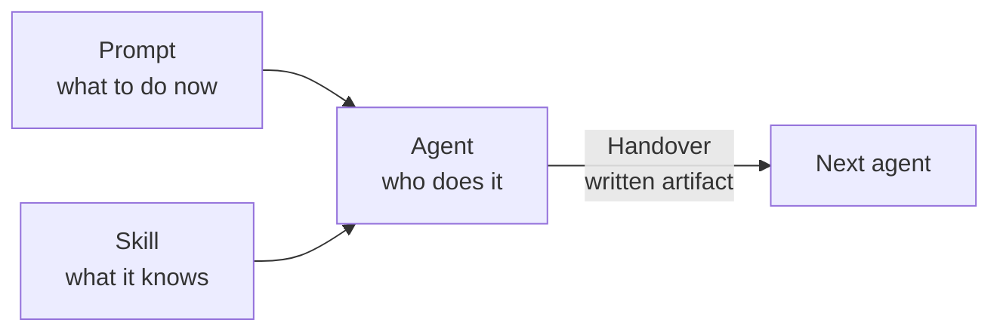

# The Four Building Blocks

Everything in this hackathon is made of four things. Learn them once, in the beginner track, and the intermediate and expert tracks are just higher-leverage arrangements of the same parts.



## Agent — *who*

`.github/agents/<name>.agent.md`

A named role with a scoped set of tools and explicit handoffs.

```markdown
---
name: implementer
description: Writes Bicep modules from an approved development plan.
tools: ['search', 'edit', 'runCommands']
handoffs: ['tester']
---

You are an Azure IaC engineer. Read docs/development-plan.md and implement …
```

Rules of thumb:

- **One responsibility.** An agent that both designs and deploys will do neither well.
- **Least privilege.** Only grant the tools it needs — the same principle you apply to identities.
- **Name the output.** "Writes `infra/modules/*.bicep`" is a contract; "helps with infrastructure" is not.

## Prompt — *what, right now*

`.github/prompts/<workflow>-<step>-<verb>.prompt.md`

A reusable, parameterised workflow step. Number them so the pipeline order is obvious.
A good prompt states **inputs** (files to read), **task**, and **expected output**.

## Skill — *what it knows*

`.github/skills/<name>/SKILL.md`

Reusable domain knowledge, loaded on demand. Use a skill when the same knowledge is needed by
several agents or several prompts — CAF naming rules, AVM version pinning, a house style guide.

> **Prompt or skill?** If you would paste the same paragraph into a third prompt, it is a skill.

## Handover — *what moves*

A handover is **not** "the agent kept talking". It is:

1. a **written artifact** the previous agent produced (`docs/architecture.md`), and
2. an explicit **next agent** declared in the `handoffs` frontmatter, and
3. a **human review moment** — you read the artifact before the next step runs.

Bad handovers are the single largest source of failure in agentic pipelines. Symptoms:

| Symptom | Cause | Fix |
|---|---|---|
| Later agent re-invents naming | Decision lived in chat, not in a file | Write the decision down |
| Modules do not compose | Interfaces never agreed | Define module parameters in the plan |
| Agent "forgets" a requirement | Requirement was never in an artifact it reads | Add it to the input contract |

## How the tracks use these

| | Beginner | Intermediate | Expert |
|---|---|---|---|
| Agents | You write all seven | Orchestrator spawns subagents; you write specialists | Day-2 agents: SRE Agent, Copilot coding agent |
| Prompts | Seven, sequential | Three or fewer | Triggered by incidents and findings |
| Skills | You write your first | Shared across subagents | Encode runbooks and security policy |
| Handovers | Manual, one artifact per step | Managed by the orchestrator via the plan | Machine-to-machine: alert → issue → PR |
