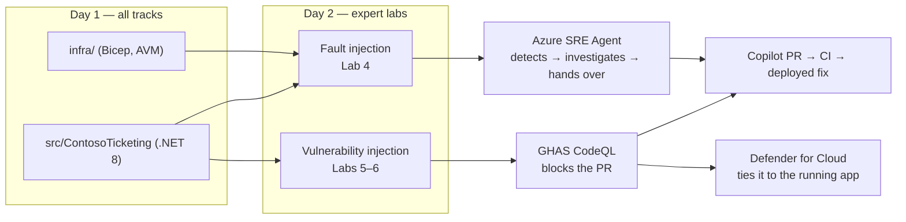

# The Reproducible Fault and the Reproducible Vulnerability

The expert labs need something to break and something to find. This document defines both, once,
for **all three tracks** — so the code a beginner or intermediate team builds on day 1 is the exact
code the Azure SRE Agent investigates and Defender for Cloud scans on day 2.

Neither the fault nor the vulnerability ships in [`src/ContosoTicketing`](../../src/ContosoTicketing/).
Both are injected deliberately, demonstrated, and then removed by the tooling.



## Technology contract

Every track builds the same stack, so every lab works on every team's repository:

| Layer | Technology | Where |
|---|---|---|
| Infrastructure | Bicep with pinned Azure Verified Modules | `infra/` |
| Application | .NET 8 minimal web API, `DOTNETCORE\|8.0` on Linux App Service | `src/ContosoTicketing/` |
| Data access | `Microsoft.Data.SqlClient` with `Authentication=Active Directory Default` | `src/ContosoTicketing/Program.cs` |
| Telemetry | Application Insights SDK → workspace-based App Insights | `src/ContosoTicketing/Program.cs`, `infra/modules/monitoring.bicep` |
| CI | `infra-ci` (Bicep) and `app-ci` (`dotnet build`, CodeQL target) | `.github/workflows/` |

Beginner and intermediate teams must deliver **both** `infra/` and a deployed
`src/ContosoTicketing`. `GET /healthz` returning `200` over HTTPS is part of the
[acceptance criteria](workload.md#acceptance-criteria).

---

## The fault — a working, then failing, SRE check

**The check**: `GET /readyz` opens a SQL connection over the private endpoint. It returns `200`
while the data path is healthy and `503` when it is not, and `GET /api/tickets` returns `500` on
the same failure. The App Service health check and the Lab 3 availability alert both watch this.

**Working state**: after deployment plus the idempotent
[`bootstrap-ticketing-database.sh`](../../scripts/bootstrap-ticketing-database.sh) run described in
the [application README](../../src/ContosoTicketing/README.md), `/readyz` returns
`{"status":"ready","database":"reachable"}`.

**Failing state** — pick one, injected by hand **outside** your IaC so it is genuine drift:

| # | Injection | Root cause the SRE Agent should reach |
|---|---|---|
| A | `ALTER ROLE db_datareader DROP MEMBER [app-…]` on the database | Managed identity lost data-plane authorisation |
| B | Delete the virtual network link on `privatelink.database.windows.net` | Name resolution falls back to the public endpoint, which is disabled |
| C | Remove the `AllowSqlFromAppSubnet` NSG rule | Connection times out at the network layer |

All three surface identically to a user — `/api/tickets` returns `500` — and differently in
telemetry, which is exactly what makes them a fair test of an investigation.

**Fixable by the tooling**: each injection is drift from `infra/` (B and C) or from the documented
grant (A). The SRE Agent proposes the runtime remediation; the handover to Copilot produces the
template or documentation fix so the fault cannot recur on redeploy. Verify with
`az deployment sub what-if` — a clean what-if plus a `200` from `/readyz` closes the incident.

> ⚠️ Record exactly what you injected before you start, and do not tell the agent. Comparing your
> note to its conclusion is the whole point of Lab 4.

---

## The vulnerability — a finding CodeQL blocks and Defender correlates

**The injection**: replace the parameterised query in `GET /api/tickets` with string concatenation
and take the filter from the query string:

```csharp
// DELIBERATELY VULNERABLE — Lab 5 only. Never merge.
app.MapGet("/api/tickets", async (string? status, ...) =>
{
    var sql = "SELECT Id, Title, Status FROM dbo.Tickets WHERE Status = '" + status + "'";
    await using var command = new SqlCommand(sql, connection);
    ...
});
```

**What must happen**:

1. CodeQL's `csharp` analysis raises **CWE-89, SQL injection**, at `security-severity` ≥ 7.0.
2. The Lab 5 severity gate **fails the pull request**, so it cannot merge.
3. The Defender for Cloud GitHub connector surfaces it as a DevOps security recommendation and ties
   it to the running `app-ticketing-…` and `sql-ticketing-…` resources (Lab 6).

**Fixable by the tooling**: revert to the parameterised `SqlCommand` with `@status` — the shape
already in `Program.cs`. Ask Copilot to fix the CodeQL alert rather than fixing it by hand; that is
the point of the exercise. The PR goes green and the Defender recommendation clears on the next scan.

> 💡 The vulnerability is in application code on purpose. The infrastructure uses managed identity,
> so there is no credential to leak — the [push-protection demo](../expert/lab-05-ghas.md#4-push-protection-10-min)
> covers that class separately.

---

## Definition of Done for this contract

- [ ] `/healthz` returns `200` and `/readyz` returns `200` against the live deployment
- [ ] One fault from the table above was injected, detected, investigated and fixed through a PR
- [ ] The SQL injection was raised by CodeQL, blocked the PR, appeared in Defender, and was fixed
- [ ] Neither the fault nor the vulnerability remains on `main`
