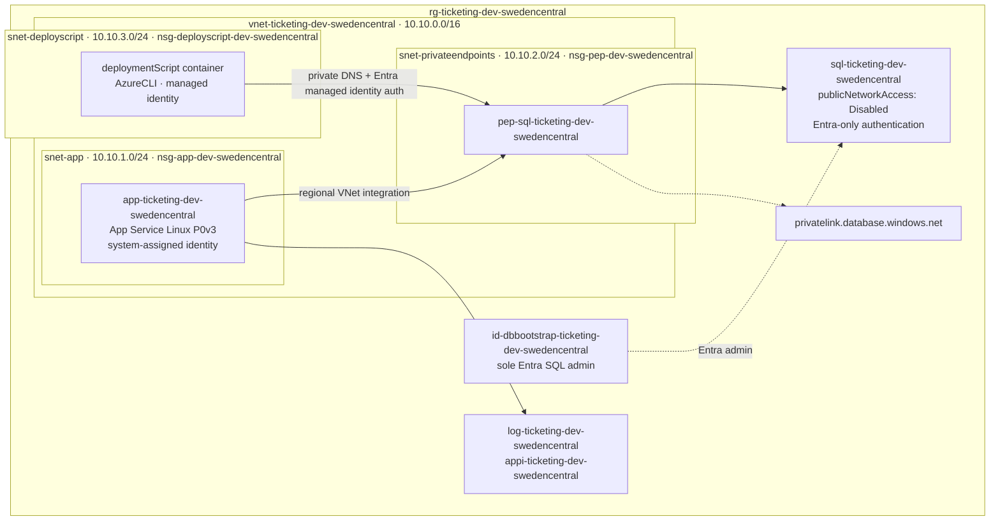

# The Shared Workload — Contoso Ticketing

This is the requirement document for **all three tracks**. Beginner and intermediate teams build it agentically; expert teams operate it. The reference implementation lives in [`infra/`](../../infra/).

## Scenario

Contoso runs an internal ticketing platform. It is a .NET web application with a relational
database. It must be reachable over HTTPS from the corporate network, the database must never
be reachable from the internet, and there must be enough telemetry to run it in production.

The application is not hypothetical: [`src/ContosoTicketing`](../../src/ContosoTicketing/) is a
minimal .NET 8 web API that every track deploys onto the App Service. Keeping the technology
identical across the three tracks is what lets the expert labs break, scan and fix **your** code —
see [the fault and vulnerability contract](fault-and-vulnerability.md).

## Architecture

## Required Resources

| Resource | CAF name | Notes |
|---|---|---|
| Resource group | `rg-<workload>-<env>-<region>` | Holds everything |
| Virtual network | `vnet-<workload>-<env>-<region>` | `10.10.0.0/16` |
| App subnet | `snet-app` | `10.10.1.0/24`, delegated to `Microsoft.Web/serverFarms` |
| Private endpoint subnet | `snet-privateendpoints` | `10.10.2.0/24` |
| Deployment script subnet | `snet-deployscript` | `10.10.3.0/24`, delegated to `Microsoft.ContainerInstance/containerGroups` |
| NSGs | `nsg-app-<env>-<region>`, `nsg-pep-<env>-<region>`, `nsg-deployscript-<env>-<region>` | Explicit deny-all inbound at priority 4096 |
| Database bootstrap identity | `id-dbbootstrap-<workload>-<env>-<region>` | User-assigned managed identity, sole Microsoft Entra SQL administrator |
| Database bootstrap script | `Microsoft.Resources/deploymentScripts` (AzureCLI) | VNet-integrated, creates the app's contained DB user and `Tickets` table |
| App Service plan | `asp-<workload>-<env>-<region>` | Linux, PremiumV3 |
| Web app | `app-<workload>-<env>-<region>` | HTTPS only, TLS 1.2+, FTPS disabled, health check `/healthz` |
| SQL Server | `sql-<workload>-<env>-<region>` | Public access disabled, Entra-only auth |
| SQL Database | `sqldb-<workload>-<env>-<region>` | Serverless General Purpose |
| Private endpoint + DNS zone | `pep-sql-…`, `privatelink.database.windows.net` | Linked to the VNet |
| Log Analytics + App Insights | `log-…`, `appi-…` | Workspace-based App Insights |

## Required Application

| Item | Requirement |
|---|---|
| Runtime | .NET 8 on Linux App Service (`DOTNETCORE\|8.0`) |
| Source | [`src/ContosoTicketing`](../../src/ContosoTicketing/) — deploy it, or write an equivalent with the same routes |
| Routes | `GET /healthz` (liveness), `GET /readyz` (checks SQL), `GET /api/tickets` |
| Data access | `Microsoft.Data.SqlClient` with `Authentication=Active Directory Default` — managed identity, no password |
| Telemetry | Application Insights SDK, connection string injected as an app setting |

The routes are not decoration: `/healthz` backs the App Service health check, and `/readyz` and
`/api/tickets` are the signals the expert track's SRE Agent labs alert and act on.

## Standards

**Naming** — `<type>-<workload>-<environment>-<region>` (CAF).

**Tags** — every resource carries `environment`, `workload`, `owner`, `costCenter`.

**Security**

- Database is **not** publicly reachable — private endpoint only.
- **Managed identity** for app→database authentication. No passwords, no secrets in code or outputs.
- NSGs use least privilege with an explicit deny-all inbound rule.
- TLS 1.2 minimum, HTTPS only, FTPS disabled.

**IaC**

- Bicep, modularised under `infra/modules/`.
- Parameters in a `.bicepparam` file — no hardcoded subscription-specific values in templates.
- `az bicep build` and `az bicep lint` must be clean, with **zero warnings**.
- **Azure Verified Modules** for every resource, pinned to an exact version
  (`br/public:avm/res/<provider>/<resource>:<version>` — never `latest`). The reference
  implementation in [`infra/`](../../infra/) does this; use it as the interface reference.

> 💡 **Pinned versions**: AVM modules evolve. Pin the version you validated against and upgrade
> deliberately — `latest` turns every redeploy into an unreviewed change, which is the opposite of
> the desired-state discipline expert Lab 2 builds on.

## Acceptance Criteria

Verify each of these against the **live** deployment, not against the template.

- [ ] `az deployment sub show` reports `Succeeded`
- [ ] Every resource follows the CAF naming convention above
- [ ] Every resource carries all four required tags
- [ ] `az sql server show --query publicNetworkAccess` returns `Disabled`
- [ ] The SQL private endpoint connection state is `Approved`
- [ ] `nslookup <sqlserver>.database.windows.net` from the app resolves to a `10.10.2.x` address
- [ ] All subnets have an NSG attached, each with a deny-all inbound rule
- [ ] The database bootstrap managed identity is the sole Microsoft Entra SQL administrator, and the
  deployment script has no public IP and runs only inside the workload VNet
- [ ] The web app has a system-assigned identity and no password or connection secret in app settings
- [ ] `az webapp show --query httpsOnly` returns `true` and `minTlsVersion` is `1.2` or higher
- [ ] Application Insights receives telemetry and is workspace-based
- [ ] Every module in `infra/` uses a version-pinned Azure Verified Module
- [ ] `GET https://<webapp>/healthz` returns `200`
- [ ] `GET https://<webapp>/readyz` returns `200` — the app reaches SQL through the private endpoint using its managed identity
- [ ] `./scripts/validate-infra.sh` passes
- [ ] `dotnet build src/ContosoTicketing` passes

## Deliberate Extension Points

The workload is intentionally minimal so that the expert track has room to work:

| Gap | Picked up by |
|---|---|
| Alert routing is environment-specific | Expert Lab 3 — connect the baseline rules to the SRE Agent or an approved action group |
| No drift detection | Expert Lab 2 — desired state |
| GHAS repository features and required checks need administrator enablement | Expert Lab 5 — GHAS *(optional)* |
| No cloud security posture | Expert Lab 6 — Defender for Cloud *(optional)* |
| No injected fault or vulnerability yet | Expert Labs 4–6 — see [the contract](fault-and-vulnerability.md) |
| Single region, no zone redundancy | Stretch goal for any track |
