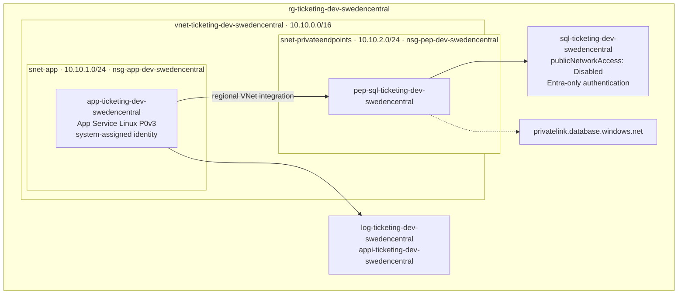

# The Shared Workload — Contoso Ticketing

This is the requirement document for **all three tracks**. Beginner and intermediate teams build it agentically; expert teams operate it. The reference implementation lives in [`infra/`](../../infra/).

## Scenario

Contoso runs an internal ticketing platform. It is a .NET web application with a relational
database. It must be reachable over HTTPS from the corporate network, the database must never
be reachable from the internet, and there must be enough telemetry to run it in production.

## Architecture

## Required Resources

| Resource | CAF name | Notes |
|---|---|---|
| Resource group | `rg-<workload>-<env>-<region>` | Holds everything |
| Virtual network | `vnet-<workload>-<env>-<region>` | `10.10.0.0/16` |
| App subnet | `snet-app` | `10.10.1.0/24`, delegated to `Microsoft.Web/serverFarms` |
| Private endpoint subnet | `snet-privateendpoints` | `10.10.2.0/24` |
| NSGs | `nsg-app-<env>-<region>`, `nsg-pep-<env>-<region>` | Explicit deny-all inbound at priority 4096 |
| App Service plan | `asp-<workload>-<env>-<region>` | Linux, PremiumV3 |
| Web app | `app-<workload>-<env>-<region>` | HTTPS only, TLS 1.2+, FTPS disabled, health check `/healthz` |
| SQL Server | `sql-<workload>-<env>-<region>` | Public access disabled, Entra-only auth |
| SQL Database | `sqldb-<workload>-<env>-<region>` | Serverless General Purpose |
| Private endpoint + DNS zone | `pep-sql-…`, `privatelink.database.windows.net` | Linked to the VNet |
| Log Analytics + App Insights | `log-…`, `appi-…` | Workspace-based App Insights |

## Standards

**Naming** — `<type>-<workload>-<environment>-<region>` (CAF).

**Tags** — every resource carries `environment`, `workload`, `owner`, `costCenter`.

**Security**

- Database is **not** publicly reachable — private endpoint only.
- **Managed identity** for app→database authentication. No passwords, no secrets in code or outputs.
- NSGs use least privilege with an explicit deny-all inbound rule.
- TLS 1.2 minimum, HTTPS only, FTPS disabled.

**IaC**

- Bicep, modularised under `infra/modules/`.
- Parameters in a `.bicepparam` file — no hardcoded subscription-specific values in templates.
- `az bicep build` and `az bicep lint` must be clean, with **zero warnings**.

> 💡 **Azure Verified Modules**: the reference implementation uses native resource types so it
> builds without registry access. Rewriting a module to use a pinned AVM module
> (`br/public:avm/res/<provider>/<resource>:<version>` — never `latest`) is an excellent
> stretch goal for any track.

## Acceptance Criteria

Verify each of these against the **live** deployment, not against the template.

- [ ] `az deployment sub show` reports `Succeeded`
- [ ] Every resource follows the CAF naming convention above
- [ ] Every resource carries all four required tags
- [ ] `az sql server show --query publicNetworkAccess` returns `Disabled`
- [ ] The SQL private endpoint connection state is `Approved`
- [ ] `nslookup <sqlserver>.database.windows.net` from the app resolves to a `10.10.2.x` address
- [ ] Both subnets have an NSG attached, each with a deny-all inbound rule
- [ ] The web app has a system-assigned identity and no password or connection secret in app settings
- [ ] `az webapp show --query httpsOnly` returns `true` and `minTlsVersion` is `1.2` or higher
- [ ] Application Insights receives telemetry and is workspace-based
- [ ] `./scripts/validate-infra.sh` passes

## Deliberate Extension Points

The workload is intentionally minimal so that the expert track has room to work:

| Gap | Picked up by |
|---|---|
| No alert rules yet | Expert Lab 3 — SRE Agent onboarding |
| No drift detection | Expert Lab 2 — desired state |
| No CI security scanning | Expert Lab 5 — GHAS |
| No cloud security posture | Expert Lab 6 — Defender for Cloud |
| Single region, no zone redundancy | Stretch goal for any track |
