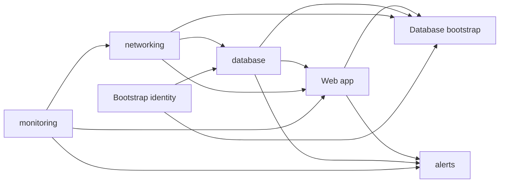

# Contoso Ticketing Deployment Guide

This guide deploys the validated Contoso Ticketing infrastructure and .NET 8 application. The
subscription-scoped entry point is `infra/main.bicep`; environment values belong in a
`.bicepparam` file or interactive inputs. Do not place subscription IDs, tenant IDs, personal
accounts, host names, tokens, keys, passwords, or other secrets in this guide or the templates.

## Mandatory controls

- Use managed identity for all Azure-to-Azure authentication. The web app uses its system-assigned
  identity for SQL; the database bootstrap uses its dedicated user-assigned identity.
- Keep Azure SQL public network access disabled. Access SQL only through the private endpoint and
  `privatelink.database.windows.net` private DNS zone.
- Keep HTTPS only, TLS 1.2 or higher, and FTPS disabled on App Service.
- Attach an NSG to every subnet, use least-privilege rules, and retain explicit deny-all inbound at
  priority 4096.
- Apply `environment`, `workload`, `owner`, and `costCenter` tags to every taggable resource.
- Use only exact, version-pinned Azure Verified Modules. Never use `latest`.
- Keep deployment-script cleanup at `OnExpiration` with retention `P1D` so logs survive the run.
- Use OIDC federation for GitHub Actions authentication. Never store an Azure client secret.

## Prerequisites

1. Install an authenticated Azure CLI with Bicep, the .NET 8 SDK, Bash, and Git.
2. Select the intended Azure subscription interactively; do not write its identifier into the
   repository.
3. Ensure the deployment identity can create subscription deployments, the workload resource
   group, role assignments, networking, App Service, Azure SQL, monitoring, managed identity,
   storage, and deployment-script resources.
4. Obtain Microsoft Entra administrator approval for Microsoft Graph `Application.Read.All` on the
   database-bootstrap managed identity. The bootstrap uses it to resolve the web app system-assigned
   service principal's public application ID. Do not substitute `Directory.Read.All` or a stored
   credential.
5. Confirm required resource providers are registered and the selected region supports the planned
   SKUs.
6. Prepare a parameter file from the interface below. Parameter values must contain no credentials.

## Composition parameters

| Parameter | Type | Required value |
|---|---|---|
| `workload` | string | Lowercase workload token, such as `<workload>` |
| `environment` | string | One of `dev`, `tst`, or `prd` |
| `location` | string | Lowercase Azure location token, such as `<region>` |
| `owner` | string | Team or service ownership label, such as `<owner>` |
| `costCenter` | string | Approved cost allocation label, such as `<cost-center>` |
| `vnetAddressPrefix` | string | Workload VNet CIDR, such as `<vnet-cidr>` |
| `appSubnetPrefix` | string | Non-overlapping App Service integration subnet CIDR |
| `privateEndpointSubnetPrefix` | string | Non-overlapping SQL private endpoint subnet CIDR |
| `deployScriptSubnetPrefix` | string | Non-overlapping deployment-script subnet CIDR |

The composition layer creates the shared tag object and passes it to every module. Resource names
follow `<type>-<workload>-<environment>-<region>`. The bootstrap storage account uses the approved
Azure-constrained convention with a deterministic six-character `uniqueString` suffix.

## Validated module interfaces

| Module | Exact AVM versions | Inputs beyond `workload`, `environment`, `location`, `tags` | Outputs | Depends on |
|---|---|---|---|---|
| `monitoring.bicep` | `operational-insights/workspace:0.16.1`, `insights/component:0.8.0` | none | `logAnalyticsWorkspaceId`, `logAnalyticsWorkspaceName`, `applicationInsightsName`, `applicationInsightsConnectionString` | Resource group |
| `networking.bicep` | `network/network-security-group:0.5.3`, `network/virtual-network:0.10.0` | `logAnalyticsWorkspaceId`, `addressPrefix`, `appSubnetPrefix`, `privateEndpointSubnetPrefix`, `deployScriptSubnetPrefix` | `virtualNetworkId`, `appSubnetId`, `privateEndpointSubnetId`, `deployScriptSubnetId` | Monitoring |
| `identity-bootstrap.bicep` | `managed-identity/user-assigned-identity:0.6.0` | none | `resourceId`, `principalId`, `clientId`, `name` | Resource group |
| `database.bicep` | `sql/server:0.22.0`, `network/private-dns-zone:0.8.1` | `privateEndpointSubnetId`, `virtualNetworkId`, `sqlAdminObjectId`, `sqlAdminLogin` | `sqlServerName`, `databaseName`, `privateEndpointName`, `privateDnsZoneName`, passwordless `connectionString` | Networking, bootstrap identity |
| `webapp.bicep` | `web/serverfarm:0.7.0`, `web/site:0.24.0` | `appSubnetId`, `applicationInsightsConnectionString`, passwordless `sqlConnectionString` | `webAppResourceId`, `webAppName`, `defaultHostName`, system identity `principalId` | Networking, monitoring, database |
| `database-bootstrap.bicep` | `storage/storage-account:0.33.0`, `resources/deployment-script:0.5.2` | `deployScriptSubnetId`, bootstrap identity IDs, SQL names, web app name and principal ID; optional `baseTime` | `deploymentScriptName` | Networking, bootstrap identity, database, web app |
| `alerts.bicep` | `insights/webtest:0.3.2`, `insights/metric-alert:0.4.1` | Web app name and host, SQL server and database names, Application Insights name | none | Monitoring, database, web app |

Deployment order is computed from output-to-input references:



## Pre-deployment validation

Run from the repository root. Warnings are failures.

```bash
./scripts/validate-infra.sh
dotnet build src/ContosoTicketing

az deployment sub validate \
  --location <deployment-location> \
  --template-file infra/main.bicep \
  --parameters <parameter-file>

az deployment sub what-if \
  --location <deployment-location> \
  --template-file infra/main.bicep \
  --parameters <parameter-file>
```

The local gates must complete with zero warnings and errors. Azure validation must report
`Succeeded`. What-if must contain only intended workload changes and no secret-valued properties.
On an initial deployment, Azure may report `NestedDeploymentShortCircuited` for modules whose inputs
depend on not-yet-created resource outputs; treat this as an evaluation limitation only after
`az deployment sub validate` succeeds and the visible changes stay within the workload scope.

Available pre-deployment evidence at documentation time:

| Check | Evidence |
|---|---|
| Bicep and parameter validation | `./scripts/validate-infra.sh` completed with zero warnings |
| Application build | `dotnet build src/ContosoTicketing` completed with zero warnings and errors |
| Azure template validation | Subscription-scope validation reported `Succeeded` |
| Azure what-if | Reported `Succeeded`; initial nested modules were partially evaluated |
| Live acceptance | Pending deployment; no `docs/test-results.md` artifact was available |

## Deploy

Use a non-sensitive deployment name and placeholders supplied at execution time:

```bash
az deployment sub create \
  --name <deployment-name> \
  --location <deployment-location> \
  --template-file infra/main.bicep \
  --parameters <parameter-file>

az deployment sub show \
  --name <deployment-name> \
  --query properties.provisioningState \
  --output tsv
```

Proceed only when the state is `Succeeded`. Deploy the application artifact to the web app using
the resource name returned by the subscription deployment; never hardcode a live host name.

## Post-deployment validation

Collect evidence against live resources, not only the generated template:

- Every resource follows the approved naming convention and carries all four required tags.
- SQL `publicNetworkAccess` is `Disabled`; private endpoint state is `Approved`.
- SQL DNS resolves from the app execution context to the private endpoint subnet.
- Every subnet has its NSG and explicit deny-all inbound rule at priority 4096.
- The bootstrap identity is the sole Entra SQL administrator; the script has no public IP and runs
  only in the workload VNet.
- The bootstrap script uses `OnExpiration` and `P1D`, and its retained logs show success.
- The web app has only its system-assigned identity and no password or connection secret setting.
- App Service is HTTPS-only, uses TLS 1.2 or higher, and has FTPS disabled.
- Workspace-based Application Insights contains recent request and dependency telemetry.
- `GET https://<webapp-host>/healthz` and `GET https://<webapp-host>/readyz` return HTTP `200`.

Record these results in `docs/test-results.md` using resource names or redacted evidence, never IDs,
host names, account names, tokens, credentials, or secrets.

## Rollback

For a failed update, stop further deployment and preserve deployment-script resources and logs.
Review what-if for the last known-good Bicep revision, then redeploy that revision with the same
approved parameter set. Bicep is the desired state; do not make persistent portal-only fixes.

For application-only regression, redeploy the last known-good application artifact, then verify
`/healthz`, `/readyz`, and telemetry. The baseline has no deployment slots, so record the artifact
version before deployment.

For a failed first deployment, diagnose before deleting anything. Resource-group deletion is a
destructive cleanup option only with workload-owner approval and confirmation that the group
contains no shared or retained evidence. Never enable public SQL access or add a password as a
rollback measure.

## Troubleshooting

| Symptom | Check | Corrective action |
|---|---|---|
| Bootstrap cannot read the web app service principal | Microsoft Graph error in retained deployment-script logs | Obtain Entra administrator consent for `Application.Read.All` on the bootstrap identity; do not grant broader directory access |
| Bootstrap cannot reach SQL | Private DNS resolution, endpoint approval, subnet delegation, and NSG TCP 1433 rule | Restore the private path in Bicep; keep SQL public access disabled |
| `/readyz` returns `503` | SQL dependency telemetry and bootstrap completion | Verify the contained app user, private DNS, private endpoint, and managed identity authorization |
| `/healthz` fails | App deployment state, runtime stack, and App Service logs | Redeploy the last known-good .NET artifact and verify `.NET 8` plus health path `/healthz` |
| What-if short-circuits nested modules | Azure diagnostics and subscription validation result | If validation succeeds, review visible scope and continue to controlled deployment; otherwise fix the reported template error |
| Bicep emits warnings | Exact AVM versions and local compiler diagnostics | Fix every warning before deployment; never suppress a local defect or use `latest` |

## Handoff to `@deployer`

Provide `@deployer` with:

- an authenticated target subscription selected outside the repository;
- `<deployment-name>`, `<deployment-location>`, and `<parameter-file>`;
- placeholder values for all nine composition parameters;
- confirmation of Entra administrator consent for bootstrap identity `Application.Read.All`;
- zero-warning results for `./scripts/validate-infra.sh` and the .NET build;
- successful Azure subscription validation and reviewed what-if output;
- an application artifact identifier for deployment and rollback;
- the post-deployment evidence checklist above.

The deployer must return the deployment state, redacted validation evidence, application route
results, and any unresolved live check. Do not report completion until every acceptance criterion is
verified against the deployment.