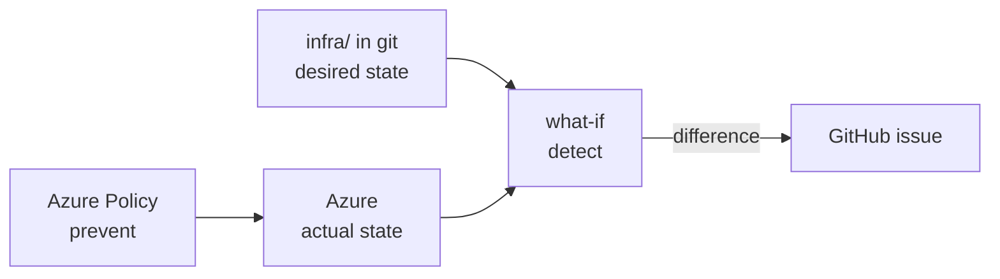

# Expert Lab 2 — Desired State and Drift

**Time**: 45 min · **Prerequisite**: Lab 1

The Azure SRE Agent can only restore a *known good* state. This lab defines what "good" means for
the Contoso Ticketing workload and makes deviation detectable and preventable.

## Objective

Source control is the desired state. Drift is detected automatically, and the most dangerous drift
is prevented outright.



## 1. Write the desired-state contract (10 min)

Create `docs/desired-state.md` in your own repository — this repo ships a reference version at
[`docs/desired-state.md`](../desired-state.md) you can compare against. For each invariant, record:
the property, its required value, how to verify it, and what happens if it drifts.

Start from the security requirements in the [workload spec](../concepts/workload.md#standards):

| Invariant | Required | Verify | On drift |
|---|---|---|---|
| SQL public network access | `Disabled` | `az sql server show --query publicNetworkAccess` | Block — auto-revert |
| Web app HTTPS only | `true` | `az webapp show --query httpsOnly` | Block — auto-revert |
| Minimum TLS | `1.2` | `az webapp show --query siteConfig.minTlsVersion` | Block |
| Deny-all NSG rule present | both NSGs | `az network nsg rule list` | Alert |
| Required tags on every resource | 4 tags | `az resource list --query …` | Alert |

Let an agent draft it from [`infra/`](../../infra/), then edit it — you own the policy, not the agent.

## 2. Drift detection with what-if (15 min)

`az deployment sub what-if` compares desired against actual. Run it in **Bash with the Azure CLI**,
from the **repository root** (dev container, local VS Code or Cloud Shell — see
[Execution Environments](../concepts/environment-options.md)):

```bash
az deployment sub what-if \
  --name ticketing-drift \
  --location swedencentral \
  --template-file infra/main.bicep \
  --parameters infra/main.bicepparam
```

Then **create real drift** in the Azure portal — for example set the web app's minimum TLS version
to 1.0 — and run the same command again. The change must show up as a modification.

Automate it: add a scheduled workflow that runs what-if daily and opens a GitHub issue when the
result is non-empty. Reuse the OIDC identity from [Lab 1](lab-01-lifecycle.md) (it only needs `Reader`).

✅ **Checkpoint**: your manual portal change produced a GitHub issue.

## 3. Prevent the worst drift with Azure Policy (15 min)

Detection is day-2; prevention is better. Assign policies at the resource-group scope so the
dangerous changes cannot happen at all. At minimum:

- **Deny** SQL servers with `publicNetworkAccess` enabled
- **Deny** web apps without HTTPS only
- **Audit** resources missing any required tag

Assign them either from **Azure portal → Policy → Assignments → Assign policy**, scoped to the
workload resource group, or — preferred — as Bicep in your own `infra/modules/policy.bicep` so the
assignment is itself desired state.

Prove it: try to re-enable public network access on the SQL server. The request must be denied.

## 4. Reconcile (5 min)

Revert the drift the honest way — redeploy from source. Run in **Bash with the Azure CLI**, from the
**repository root**:

```bash
az deployment sub create \
  --name ticketing-reconcile \
  --location swedencentral \
  --template-file infra/main.bicep \
  --parameters infra/main.bicepparam
```

Re-run what-if. It must report no changes.

---

## Definition of Done

- [ ] Your `docs/desired-state.md` (compare with the [reference version](../desired-state.md)) lists every invariant with verification and drift response
- [ ] A scheduled workflow detects drift and opens a GitHub issue
- [ ] Azure Policy denies at least the two critical misconfigurations
- [ ] A demonstrated drift → detect → reconcile → clean what-if cycle

➡️ Next: [Lab 3 — Onboard the Azure SRE Agent](lab-03-sre-agent.md)
