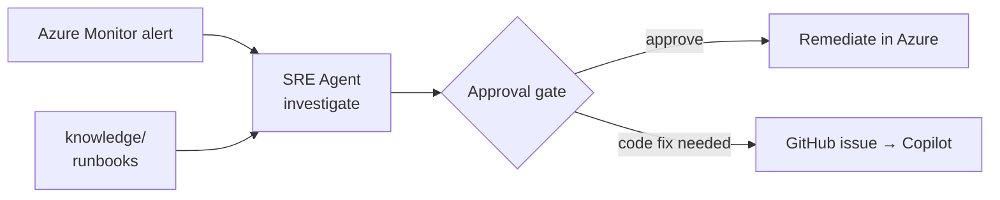

# Expert Lab 3 — Onboard the Azure SRE Agent

**Time**: 60 min · **Prerequisite**: [Lab 2 — Desired state & drift](lab-02-desired-state.md)

This lab is **self-contained**: every step is described here, either as an Azure portal click-path or
as an Azure CLI / Bicep command. The only external references are Microsoft's own product
documentation, linked where a portal screen may have changed since this lab was written.

## Objective

The Azure SRE Agent monitors the workload, investigates alerts autonomously, proposes remediation
behind an approval gate, and can hand work to GitHub Copilot when the fix belongs in code.



## 1. Concepts (10 min)

The Azure SRE Agent is a managed Azure resource that watches a set of resource groups, correlates
Azure Monitor alerts, logs, Resource Graph and Service Health, and proposes or performs remediation.
Its permission level per resource group decides whether it may only read (**Reader**) or also act
(**Privileged**) — and even when privileged, actions surface as an approval request unless you
explicitly allow them.

Answer as a team before touching the portal:

- What does the SRE Agent do **without** approval, and what requires approval?
- Which data sources does it investigate with? (Azure Monitor, Resource Graph, Service Health, activity logs)
- Why does giving it *your* runbooks change the quality of its investigations?

Reference reading: [What is Azure SRE Agent](https://learn.microsoft.com/azure/sre-agent/overview).

## 2. Check prerequisites (5 min)

The SRE Agent is available in a limited set of regions — `swedencentral`, `eastus2`,
`australiaeast`. Run in **Bash with the Azure CLI**, from the **repository root** (dev container,
local VS Code or Cloud Shell — see [Execution Environments](../concepts/environment-options.md)):

```bash
az group show --name rg-ticketing-dev-swedencentral --query location -o tsv
```

If the resource group is not in a supported region, redeploy from source into one.

You also need, on the subscription:

- **Owner** or **User Access Administrator** — the agent's managed identity needs role assignments.
- The resource providers listed as prerequisites in
  [Create an Azure SRE Agent](https://learn.microsoft.com/azure/sre-agent/create-agent) registered.
  The portal offers to register any that are missing; to check or register one yourself:

```bash
az provider show --namespace <provider-namespace> --query registrationState -o tsv
az provider register --namespace <provider-namespace>
```

If your network is restricted, allow outbound access to `*.azuresre.ai`.

## 3. Create the agent and scope it (15 min)

Do this **in the Azure portal**. Nothing here depends on any other repository.

1. Open the Azure portal and search the global search box for **SRE Agent**, then choose
   **Create** (the agent experience is also reachable at <https://sre.azure.com>).
2. **Basics**:
   - **Subscription** — the subscription holding the Contoso Ticketing workload.
   - **Resource group** — create a *separate* resource group for the agent itself, for example
     `rg-sreagent-dev-swedencentral`. Keeping the agent out of the workload resource group means
     the agent is not part of the workload's own desired state or blast radius.
   - **Name** — `sre-ticketing-dev-swedencentral` (CAF naming, as everywhere else).
   - **Region** — `swedencentral`, `eastus2` or `australiaeast`, matching your workload.
   - **Model provider / Application Insights** — accept the defaults unless your coaches say
     otherwise.
3. **Resource groups to monitor** — select **only** `rg-ticketing-dev-swedencentral`. Do **not**
   select the subscription or unrelated resource groups; least privilege is a graded requirement.
4. **Permission level** — start at **Reader**. Raise a single resource group to **Privileged** only
   after [Lab 4](lab-04-incident-handover.md) has shown you what the agent proposes, and record the
   decision in your autonomy matrix in [Lab 7](lab-07-close-the-loop.md).
5. **Review + create**.

After deployment, open the agent → **Settings → Managed resources** and confirm the scope. Record
two values — [Lab 4](lab-04-incident-handover.md) needs both:

| Value | Where to find it |
|---|---|
| Agent name | Agent overview blade |
| Agent managed identity (object ID) | Agent → **Settings → Basics → Managed identity** |

Verify the identity's role assignments from the CLI, from any Bash shell with the Azure CLI:

```bash
az role assignment list \
  --assignee <agent-managed-identity-object-id> \
  --all -o table
```

Expect a scope ending in `/resourceGroups/rg-ticketing-dev-swedencentral` and nothing broader. If a
subscription-scoped assignment appears, delete it:

```bash
az role assignment delete \
  --assignee <agent-managed-identity-object-id> \
  --scope /subscriptions/<subscription-id>
```

✅ **Checkpoint**: the agent lists your web app, SQL server and Log Analytics workspace as in-scope
resources, and holds no role above the workload resource group.

> 📚 Portal screens change. If a step above no longer matches, follow
> [Create an Azure SRE Agent](https://learn.microsoft.com/azure/sre-agent/create-agent) and
> [Manage permissions](https://learn.microsoft.com/azure/sre-agent/manage-permissions), then keep
> the same two rules: scope to the workload resource group only, and start read-only.

### Confirm the SQL data-plane bootstrap

Before asking the agent to investigate readiness, complete the private-network bootstrap described
in [`docs/operations-runbook.md`](../operations-runbook.md). Run it in **Bash with the Azure CLI**,
from the **repository root**, on a host connected to the workload VNet, signed in as the configured
Microsoft Entra SQL administrator. Pass the **subscription deployment name** used with
`az deployment sub create --name`; this is how the script resolves the workload outputs:

```bash
./scripts/bootstrap-ticketing-database.sh --deployment-name ticketing-baseline
```

Ordinary Cloud Shell and a default dev container cannot reach the SQL private endpoint — see
[Execution Environments](../concepts/environment-options.md). The App Service managed identity
cannot create its own contained database user: it has no SQL authorization until the administrator
creates that principal. Never enable public SQL access or introduce a password to bypass this
bootstrap.

## 4. Give it signals (15 min)

An agent with no alerts has nothing to investigate. The reference baseline already includes
[`infra/modules/alerts.bicep`](../../infra/modules/alerts.bicep); verify that your rolled-up
implementation has equivalent rules, then customise it **as code** to route the alerts to the SRE
Agent or an approved action group:

| Alert | Signal | Severity |
|---|---|---|
| App HTTP 5xx | `Http5xx` > 5 in 5 min | 2 |
| App response time | Average > 3 s over 5 min | 3 |
| App availability | App Service health check (`/healthz`) failing | 1 |
| App readiness | Availability test against `/readyz` failing | 1 |
| SQL DTU/CPU | > 85%; 15 min (nearest Azure Monitor-supported window to the 10 min lab target) | 3 |

The `/healthz` and `/readyz` routes come from [`src/ContosoTicketing`](../../src/ContosoTicketing/),
which every track deploys, so these alerts work on any team's baseline. The readiness alert is the
**working SRE check** that [Lab 4](lab-04-incident-handover.md) then breaks — see
[the fault and vulnerability contract](../concepts/fault-and-vulnerability.md).

Have your [`@implementer`](../../.github/agents/implementer.agent.md) agent write the module in
**Copilot Chat in VS Code**, then validate in **Bash with the Azure CLI**, from the **repository
root**:

```bash
./scripts/validate-infra.sh
```

Deploy it with the same subscription-scope deployment you use everywhere else:

```bash
az deployment sub create \
  --name ticketing-baseline \
  --location swedencentral \
  --template-file infra/main.bicep \
  --parameters infra/main.bicepparam
```

The reference module intentionally leaves `actions` empty because action-group destinations are
environment-specific. Connect the rules to the SRE Agent or an approved action group after
deployment, in **Azure portal → Monitor → Alerts → Alert rules**.

✅ **Checkpoint**: alert rules are deployed and visible to the SRE Agent.

## 5. Give it knowledge (10 min)

Create a `knowledge/` directory in **your own repository** and add the operational context the agent
should use:

- `knowledge/architecture.md` — a short version of your architecture and dependencies
- `knowledge/runbook-http-500.md` — how to diagnose a 5xx from `/api/tickets` and a 503 from `/readyz` in this workload
- `knowledge/escalation.md` — what may be auto-remediated and what must page a human

Commit and push them, then attach the repository as a knowledge source in step 6 below. This is
exactly the beginner track's **skill** concept, applied to an operations agent.

## 6. Connect GitHub (5 min)

Without this connection, [Lab 4](lab-04-incident-handover.md)'s handover to Copilot cannot happen.
In the SRE Agent:

1. Open the agent → **Builder → Knowledge base → Add repository**.
2. Choose **GitHub**, authenticate with **OAuth** (simplest for the hackathon) or with a GitHub App
   if your organisation requires one. Do not paste a long-lived personal access token into any file
   in this repository.
3. Select your Contoso Ticketing repository so the agent can read `knowledge/`, `infra/` and `src/`.
4. Open **Builder → Connectors → Add connector → GitHub** and authorise it. This is what lets the
   agent **create issues** — the knowledge-base connection alone is read-only.
5. In **GitHub → repository Settings → Copilot → Coding agent**, make sure the Copilot coding agent
   is enabled so it can be assigned the issues the SRE Agent files.

Verify by asking the agent, in its chat: *"List the open issues in `<owner>/<repo>` and summarise
them."* A correct answer proves both the connector and its permissions.

> 📚 If the portal wording differs, see
> [Connect source code to Azure SRE Agent](https://learn.microsoft.com/azure/sre-agent/connect-source-code)
> and [Set up the GitHub connector](https://learn.microsoft.com/azure/sre-agent/setup-github-connector).

---

## Definition of Done

- [ ] SRE Agent created, scoped to the workload resource group only, starting at least privilege
- [ ] Agent name and managed identity object ID recorded for [Lab 4](lab-04-incident-handover.md)
- [ ] [`infra/modules/alerts.bicep`](../../infra/modules/alerts.bicep) deployed and part of the desired state
- [ ] `knowledge/` contains architecture, at least one runbook and an escalation policy
- [ ] The agent is connected to your GitHub repository and can list its issues

➡️ Next: [Lab 4 — Incident → agent handover](lab-04-incident-handover.md)
