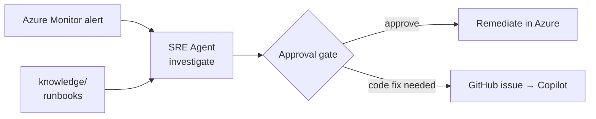

# Expert Lab 3 — Onboard the Azure SRE Agent

**Time**: 60 min · **Prerequisite**: Lab 2

**Source**: [JoranBergfeld/sre-agent-workshop](https://github.com/JoranBergfeld/sre-agent-workshop) —
read [`docs/00-what-is-sre-agent.md`](https://github.com/JoranBergfeld/sre-agent-workshop/blob/main/docs/00-what-is-sre-agent.md),
`01-why-sre-agent.md` and `02-how-it-works.md` before starting. This lab applies that workshop's
pattern to **your** Contoso Ticketing deployment.

## Objective

The Azure SRE Agent monitors the workload, investigates alerts autonomously, proposes remediation
behind an approval gate, and can hand work to GitHub Copilot when the fix belongs in code.



## 1. Concepts (10 min)

Answer as a team before touching the portal:

- What does the SRE Agent do **without** approval, and what requires approval?
- Which data sources does it investigate with? (Azure Monitor, Resource Graph, Service Health, activity logs)
- Why does giving it *your* runbooks change the quality of its investigations?

## 2. Check availability (5 min)

The SRE Agent is available in a limited set of regions — `swedencentral`, `eastus2`,
`australiaeast`. Confirm your resource group is in one of them:

```bash
az group show --name rg-ticketing-dev-swedencentral --query location -o tsv
```

If not, redeploy from source into a supported region.

## 3. Create the agent and scope it (15 min)

In the Azure portal, create an **Azure SRE Agent** and scope it to your workload's **resource
group** — not the whole subscription. Grant the least privilege that still allows remediation.

Record the agent name and its managed identity; Lab 4 needs both.

✅ **Checkpoint**: the agent lists your web app, SQL server and Log Analytics workspace as in-scope resources.

## 4. Give it signals (15 min)

An agent with no alerts has nothing to investigate. Add alert rules to `infra/` — **as code**,
in a new `infra/modules/alerts.bicep`, so they are part of the desired state from Lab 2:

| Alert | Signal | Severity |
|---|---|---|
| App HTTP 5xx | `Http5xx` > 5 in 5 min | 2 |
| App response time | Average > 3 s over 5 min | 3 |
| App availability | App Service health check (`/healthz`) failing | 1 |
| App readiness | Availability test against `/readyz` failing | 1 |
| SQL DTU/CPU | > 85% for 10 min | 3 |

The sre-agent-workshop keeps alerts in `scenarios/<id>/infra/bicep/modules/alert.bicep` — same idea.
The `/healthz` and `/readyz` routes come from [`src/ContosoTicketing`](../../src/ContosoTicketing/),
which every track deploys, so these alerts work on any team's baseline. The readiness alert is the
**working SRE check** that Lab 4 then breaks — see
[the fault and vulnerability contract](../concepts/fault-and-vulnerability.md).

Have your `@implementer` agent write the module, then validate and deploy:

```bash
./scripts/validate-infra.sh
```

✅ **Checkpoint**: alert rules are deployed and visible to the SRE Agent.

## 5. Give it knowledge (10 min)

Create `knowledge/` in your repo and add the operational context the agent should use:

- `knowledge/architecture.md` — a short version of your architecture and dependencies
- `knowledge/runbook-http-500.md` — how to diagnose a 5xx from `/api/tickets` and a 503 from `/readyz` in this workload
- `knowledge/escalation.md` — what may be auto-remediated and what must page a human

This is exactly the beginner track's **skill** concept, applied to an operations agent.

## 6. Connect GitHub (5 min)

Follow
[`docs/connect-github-to-sre-agent.md`](https://github.com/JoranBergfeld/sre-agent-workshop/blob/main/docs/connect-github-to-sre-agent.md)
to connect the SRE Agent to your repository. Without this, Lab 4's handover to Copilot cannot happen.

---

## Definition of Done

- [ ] SRE Agent created, scoped to the workload resource group, least privilege
- [ ] `infra/modules/alerts.bicep` deployed and part of the desired state
- [ ] `knowledge/` contains architecture, at least one runbook and an escalation policy
- [ ] The agent is connected to your GitHub repository

➡️ Next: [Lab 4 — Incident → agent handover](lab-04-incident-handover.md)
