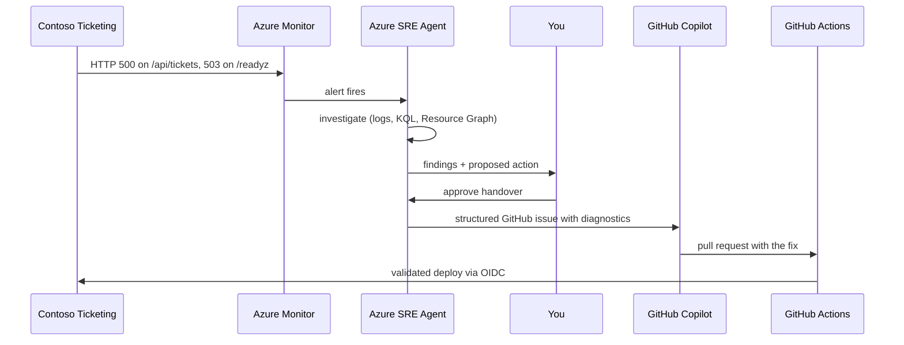

# Expert Lab 4 — Incident → Agent Handover

**Time**: 75 min · **Prerequisite**: [Lab 3 — Onboard the Azure SRE Agent](lab-03-sre-agent.md)

This lab is **self-contained**: the fault, the checks and the handover are all defined inside this
repository. The scenario is the classic *cloud agent handover* pattern — an App Service based
workload where a runtime failure is investigated by an operations agent and, when the fix belongs
in code, handed to a coding agent as a structured issue.

## Objective

Run a full incident lifecycle where **two agents hand over to each other**: the Azure SRE Agent
investigates a live incident and, when the fix belongs in code, hands a structured GitHub issue to
GitHub Copilot, which produces a pull request that your CI validates and deploys.

This is the beginner track's **handover** concept — but machine-to-machine and in production.



## Before the exercise: configure a review response plan

Create one Azure Monitor response plan before injecting a fault:

1. If a default `quickstart` plan is enabled, open **Builder → Incident response plans**, switch
   to **Table view**, and delete it so the alert is not routed twice.
2. Open **Builder → Agent Canvas → Create → Trigger → Incident response plan**.
3. Name it `ticketing-incident-review`, select this SRE Agent, and match only the deployed
   readiness/HTTP 5xx alert at **Severity 1 or 2**. Use the exact alert title shown in Azure Monitor,
   not a broad all-incidents filter.
4. Set **Agent autonomy level** to **Review** and leave the default three-hour
   **Reinvestigation cooldown** enabled. Review is the required mode for the main exercise.
5. Preview the matching incidents, create the plan, and confirm it is **On** with the intended
   severity/title filters and cooldown.

Review mode means the agent investigates and presents evidence before the learner approves issue
creation. The SRE Agent must create at most one unassigned issue; the learner reviews it and assigns
`copilot-swe-agent`.

> **Safety boundary:** Do not set the production-connected plan to **Automatic** (also labelled
> **Autonomous** in some portal experiences). The repository escalation policy is approval-gated.
> Automatic mode is an optional, isolated comparison exercise below, not the default operating
> posture.

## 1. Prepare the fault (20 min)

The fault is defined once, for all tracks, in
[`docs/concepts/fault-and-vulnerability.md`](../concepts/fault-and-vulnerability.md). Read it now.

First confirm the **working** state — this is the SRE check that must pass before you break it. Run
in **Bash** (any shell with `curl`; dev container, local VS Code or Cloud Shell — see
[Execution Environments](../concepts/environment-options.md)), replacing `<webapp>` with your web
app name:

```bash
curl -s -o /dev/null -w '%{http_code}\n' https://<webapp>.azurewebsites.net/readyz   # expect 200
curl -s -o /dev/null -w '%{http_code}\n' https://<webapp>.azurewebsites.net/api/tickets  # expect 200
```

If readiness has never returned `200`, do not inject a fault. Confirm the automatic private SQL
bootstrap described in [`docs/operations-runbook.md`](../operations-runbook.md) succeeded — the
VNet-integrated deployment script runs
[`./scripts/bootstrap-ticketing-database-deploymentscript.sh`](../../scripts/bootstrap-ticketing-database-deploymentscript.sh)
as part of `az deployment sub create`; re-run that deployment if it did not.
The App Service managed identity cannot create its own SQL principal; the Entra SQL
administrator identity must establish that initial data-plane authorization.

Then inject exactly one of injections **A**, **B** or **C** from that document — a dropped database
role membership, a deleted private DNS virtual network link, or a removed NSG rule. All three make
`/api/tickets` return `500` and `/readyz` return `503`, and each leaves a different trail in
telemetry.

> ⚠️ Do this **outside** your IaC, by hand. Lab 2 taught you that source is the desired state; here
> you are deliberately creating drift so the agents have something real to find. Write down exactly
> what you changed, and do not tell the agent — you will compare your note to its conclusion.

## 2. Trigger and observe (20 min)

Drive traffic to the broken route until the alert fires — from **Bash**, replacing `<webapp>`:

```bash
for i in $(seq 1 60); do
  curl -s -o /dev/null https://<webapp>.azurewebsites.net/api/tickets
  sleep 5
done
```

Then **watch without helping**, in the SRE Agent's chat/incident view in the Azure portal. Record:

| Question | Your observation |
|---|---|
| Time to alert | |
| Data sources the agent used | |
| Did it identify the correct root cause? | |
| What did it propose? | |
| Did it ask for approval before acting? | |

✅ **Checkpoint**: the SRE Agent produced an investigation with a root-cause hypothesis.

## 3. Approve the handover (15 min)

When the agent proposes an action, evaluate it before approving:

- Is this a **runtime** fix (restart, scale, restore a setting) → the SRE Agent only proposes it;
  an authorised human executes it after approval, records the command and rollback, and updates
  desired state where required.
- Is this a **code or template** fix → approve one issue handover and let the learner assign the
  reviewed issue to `copilot-swe-agent`.

Approve, and confirm exactly one **unassigned** GitHub issue contains: symptom, affected resource,
supporting telemetry, root-cause hypothesis and suggested fix. **A handover without evidence is just
a ticket.** The SRE Agent must not create a branch or pull request, merge changes, deploy code or
make direct Azure changes.

## 4. Copilot fixes it (15 min)

Assign the reviewed issue to GitHub Copilot (**GitHub → Issues → the issue → Assignees → Copilot**;
API identity `copilot-swe-agent`). It should open a pull request. Review it as an engineer:

- [ ] Does it fix the root cause or only the symptom?
- [ ] Does it also fix the **template**, so the fault cannot recur on redeploy?
- [ ] Does [`infra-ci`](../../.github/workflows/infra-ci.yml) ([Lab 1](lab-01-lifecycle.md)) pass on the PR?

Merge it and let CI deploy through the OIDC pipeline.

## 5. Verify and close (5 min)

Run the two `curl` checks from step 1 again, and the drift check from the **repository root** in
**Bash with the Azure CLI**:

```bash
az deployment sub what-if \
  --name ticketing-drift \
  --location swedencentral \
  --template-file infra/main.bicep \
  --parameters infra/main.bicepparam
```

- [ ] `GET /readyz` returns `200` and `GET /api/tickets` returns `200` again
- [ ] The alert has resolved
- [ ] `az deployment sub what-if` reports no drift
- [ ] The incident, investigation and fix are captured in [`docs/operations-runbook.md`](../operations-runbook.md)

## 6. Reflect

1. Where did the SRE Agent's conclusion differ from what you actually broke?
2. What did the handover issue lack that a human would have included?
3. Which knowledge file from [Lab 3](lab-03-sre-agent.md) would have made the investigation faster?
4. Which parts of this loop would you let run without an approval gate — and which never?

## 7. Optional autonomy comparison (10 min)

Complete the main Review-mode exercise first. This comparison validates the behavior change without
changing the learning objective or the repository's approval policy. It is only permitted with a
disposable sandbox SRE Agent, workload, alert and GitHub repository; never reuse the
production-connected agent or workload from Labs 3–4.

1. Before enabling Automatic mode, verify the sandbox SRE Agent has only Reader access to the
   sandbox resource group, has no runtime remediation or deployment permissions, and is connected
   only to a disposable GitHub repository. If these conditions cannot be proven, skip this section.
2. Create a **separate, sandbox-only response plan** with a sandbox alert title and severity filter;
   do not edit the completed `ticketing-incident-review` plan or point the sandbox plan at the
   production workload.
3. Set **Agent autonomy level** to **Automatic** (or **Autonomous**, depending on the portal label),
   keep the three-hour cooldown, and confirm the plan is **On**. Do not enable runtime remediation,
   Azure mutation, deployment, merge or workflow permissions for this comparison.
4. Inject one new, reversible fault from the contract and drive the matching alert. Observe whether
   the agent proceeds to the configured handover without asking for approval. Record:

   | Question | Your observation |
   |---|---|
   | Did the agent investigate before acting? | |
   | Did it create an issue without approval? | |
   | Was the issue unassigned and evidence-backed? | |
   | Did the cooldown prevent duplicate processing? | |
5. Revert the sandbox fault, confirm the sandbox alert and incident are resolved, and wait for all
   Automatic/Autonomous runs to reach a terminal state. Verify whether an issue was already created.
6. Disable the Automatic/Autonomous plan and confirm it is **Off**. Leave the production-connected
   `ticketing-incident-review` plan **On** in **Review** before leaving the lab.

If the tenant cannot provide this isolated sandbox, skip this comparison and record that the approval
gate remains mandatory for the workload.

📄 See [an example structured incident handover issue](../tracks/examples/expert/handovers/sre-incident-issue.md) to check your own handover's shape against.

---

## Definition of Done

- [ ] An incident was injected, alerted and investigated by the SRE Agent
- [ ] A Review-mode response plan matched only the intended alert and retained its cooldown
- [ ] A handover was approved and produced a structured GitHub issue
- [ ] The issue was unassigned until the learner reviewed and assigned it to Copilot
- [ ] Copilot produced a PR that CI validated and deployed
- [ ] The alert resolved and what-if reports no drift
- [ ] The runbook was updated with what you learned
- [ ] Optional: Automatic/Autonomous mode was tested only in an isolated, handover-only plan and
      then reverted to Review

➡️ Next: [Lab 5 — GHAS on the IaC repo](lab-05-ghas.md) *(optional — or skip to [Lab 7](lab-07-close-the-loop.md))*
