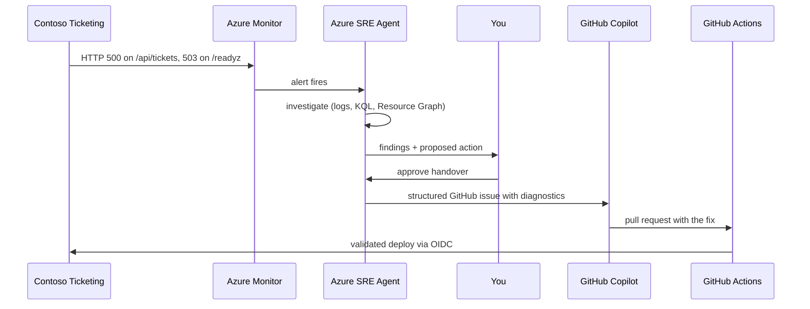

# Expert Lab 4 — Incident → Agent Handover

**Time**: 75 min · **Prerequisite**: Lab 3

**Source**: the `cloud-agent-handover` scenario in
[JoranBergfeld/sre-agent-workshop](https://github.com/JoranBergfeld/sre-agent-workshop/tree/main/scenarios/cloud-agent-handover)
— App Service based, low cost, and the closest match to the Contoso Ticketing workload. Read its
`README.md` and `docs/90-watch-sre-agent.md` first.

## Objective

Run a full incident lifecycle where **two agents hand over to each other**: the Azure SRE Agent
investigates a live incident and, when the fix belongs in code, hands a structured GitHub issue to
GitHub Copilot, which produces a pull request that your CI validates and deploys.

This is the beginner track's **handover** concept — but machine-to-machine and in production.



## 1. Prepare the fault (20 min)

The fault is defined once, for all tracks, in
[`docs/concepts/fault-and-vulnerability.md`](../concepts/fault-and-vulnerability.md). Read it now.

First confirm the **working** state — this is the SRE check that must pass before you break it:

```bash
curl -s -o /dev/null -w '%{http_code}\n' https://<webapp>.azurewebsites.net/readyz   # expect 200
curl -s -o /dev/null -w '%{http_code}\n' https://<webapp>.azurewebsites.net/api/tickets  # expect 200
```

Then inject exactly one of injections **A**, **B** or **C** from that document — a dropped database
role membership, a deleted private DNS virtual network link, or a removed NSG rule. All three make
`/api/tickets` return `500` and `/readyz` return `503`, and each leaves a different trail in
telemetry.

> ⚠️ Do this **outside** your IaC, by hand. Lab 2 taught you that source is the desired state; here
> you are deliberately creating drift so the agents have something real to find. Write down exactly
> what you changed, and do not tell the agent — you will compare your note to its conclusion.

## 2. Trigger and observe (20 min)

Drive traffic to the broken route until the alert fires, then **watch without helping**. Record:

| Question | Your observation |
|---|---|
| Time to alert | |
| Data sources the agent used | |
| Did it identify the correct root cause? | |
| What did it propose? | |
| Did it ask for approval before acting? | |

✅ **Checkpoint**: the SRE Agent produced an investigation with a root-cause hypothesis.

## 3. Approve the handover (15 min)

When the agent proposes an action, evaluate it before approving:

- Is this a **runtime** fix (restart, scale, revert a setting) → remediate in Azure, then update IaC so it is not drift.
- Is this a **code or template** fix → hand it to GitHub Copilot as an issue.

Approve, and confirm the GitHub issue that gets created contains: symptom, affected resource,
supporting telemetry, root-cause hypothesis and suggested fix. **A handover without evidence is
just a ticket.**

## 4. Copilot fixes it (15 min)

Assign the issue to GitHub Copilot. It should open a pull request. Review it as an engineer:

- [ ] Does it fix the root cause or only the symptom?
- [ ] Does it also fix the **template**, so the fault cannot recur on redeploy?
- [ ] Does `infra-ci` (Lab 1) pass on the PR?

Merge it and let CI deploy through the OIDC pipeline.

## 5. Verify and close (5 min)

- [ ] `GET /readyz` returns `200` and `GET /api/tickets` returns `200` again
- [ ] The alert has resolved
- [ ] `az deployment sub what-if` reports no drift
- [ ] The incident, investigation and fix are captured in `docs/operations-runbook.md`

## 6. Reflect

1. Where did the SRE Agent's conclusion differ from what you actually broke?
2. What did the handover issue lack that a human would have included?
3. Which knowledge file from Lab 3 would have made the investigation faster?
4. Which parts of this loop would you let run without an approval gate — and which never?

---

## Definition of Done

- [ ] An incident was injected, alerted and investigated by the SRE Agent
- [ ] A handover was approved and produced a structured GitHub issue
- [ ] Copilot produced a PR that CI validated and deployed
- [ ] The alert resolved and what-if reports no drift
- [ ] The runbook was updated with what you learned

➡️ Next: [Lab 5 — GHAS on the IaC repo](lab-05-ghas.md)
