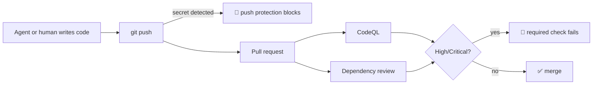

# Expert Lab 5 — GitHub Advanced Security on the IaC Repo (Optional)

**Time**: 60 min · **Prerequisite**: [Lab 1 — Lifecycle hardening](lab-01-lifecycle.md)

> 🟡 **Optional lab.** This lab requires a GHAS-enabled (Enterprise/GitHub Advanced Security)
> repository, which is a paid GitHub entitlement not included with this hackathon. If your fork
> does not have GHAS available, skip to [Lab 7](lab-07-close-the-loop.md) and note the security
> lane as skipped in `docs/feedback-loops.md`.

This lab is **self-contained**: every setting is either a documented GitHub click-path or a `gh` CLI
command you can run from this repository. No other repository needs to exist.

## Objective

Vulnerabilities and secrets are caught **before** they reach `main`, and the pipeline blocks them
automatically — not as a report someone reads later.



## 1. Enable the features (10 min)

In repository **Settings → Advanced Security**, enable:

- [ ] **Secret scanning** and **push protection**
- [ ] **Code scanning** (CodeQL)
- [ ] **Dependency graph** and **Dependabot alerts** + **security updates**

Clicking works, but reproducible is better. The same settings can be applied with the **GitHub CLI**
from the **repository root**, in a shell where `gh auth login` has already succeeded:

```bash
gh api -X PATCH repos/{owner}/{repo} \
  -f 'security_and_analysis[secret_scanning][status]=enabled' \
  -f 'security_and_analysis[secret_scanning_push_protection][status]=enabled' \
  -f 'security_and_analysis[dependabot_security_updates][status]=enabled'
```

Capture whichever approach you choose in your own `scripts/setup-repo.sh` so a second team can
reproduce it.

## 2. CodeQL in CI (15 min)

Add a CodeQL workflow. Your repository has two analysable languages:

- **`actions`** — scans the workflow YAML in [`.github/workflows/`](../../.github/workflows/) itself
- **`csharp`** — [`src/ContosoTicketing`](../../src/ContosoTicketing/), the .NET 8 API every track deploys

Add a `.github/codeql-config.yml` to scope paths and query suites. Extend the existing
[`.github/workflows/app-ci.yml`](../../.github/workflows/app-ci.yml) workflow rather than creating a
parallel one.

✅ **Checkpoint**: a CodeQL run appears under the **Security** tab.

## 3. Fail the build on high severity (10 min)

Alerts nobody blocks on are decoration. Add a job step that reads the CodeQL SARIF output (or the
code-scanning alerts API) and **fails the job** when any finding has `security-severity >= 7.0`
(High/Critical). A workable shape, run inside the workflow after the CodeQL analyse step:

```bash
gh api repos/{owner}/{repo}/code-scanning/alerts --jq \
  '[.[] | select(.state=="open" and (.rule.security_severity_level|IN("high","critical")))] | length'
```

Fail the step when that count is greater than zero.

Then prove it with the vulnerability defined in
[`docs/concepts/fault-and-vulnerability.md`](../concepts/fault-and-vulnerability.md): on a branch,
replace the parameterised query in `GET /api/tickets` with string concatenation of a query-string
value, and open a PR. CodeQL must raise **CWE-89, SQL injection** at `security-severity` ≥ 7.0.

✅ **Checkpoint**: the PR is blocked by a failing CodeQL check.

📄 See [an example of the CodeQL alert and the failing/passing gate](../tracks/examples/expert/outputs/lab-05-codeql-gate.md) to check your implementation against.

Now fix it **with the tooling** — assign the CodeQL alert to Copilot and review its PR rather than
reverting by hand. Keep the branch: [Lab 6](lab-06-defender.md) traces this same finding to the running resources.

## 4. Push protection (10 min)

Commit a realistic-looking credential to a branch and push it.

✅ **Checkpoint**: GitHub **blocks the push** before the secret reaches the repository.

Discuss: your baseline uses managed identity precisely so this class of secret does not exist.
Push protection is the backstop for when someone — or some agent — reaches for a connection string anyway.

## 5. Dependency review and Dependabot (5 min)

- [ ] `actions/dependency-review-action@v4` runs on pull requests
- [ ] `.github/dependabot.yml` covers every ecosystem in the repo — `nuget` for [`src/`](../../src/), plus `github-actions`

## 6. Make it required (10 min)

Extend the branch protection from [Lab 1](lab-01-lifecycle.md) on `main`
(**GitHub → repository Settings → Branches**):

- [ ] CodeQL is a **required** status check
- [ ] [`infra-ci`](../../.github/workflows/infra-ci.yml) is a **required** status check
- [ ] Secret scanning push protection is enabled and not bypassable without a documented reason

---

## Definition of Done

- [ ] Secret scanning + push protection, code scanning, dependency graph and Dependabot all enabled
- [ ] CodeQL runs in CI over both `actions` and `csharp`
- [ ] The SQL injection from the [shared contract](../concepts/fault-and-vulnerability.md) **fails** the PR — demonstrated, then fixed by Copilot
- [ ] A pushed secret was **blocked** — demonstrated
- [ ] `main` requires both CodeQL and `infra-ci`

➡️ Next: [Lab 6 — Defender for Cloud & code-to-cloud](lab-06-defender.md) *(optional — or skip to [Lab 7](lab-07-close-the-loop.md))*
