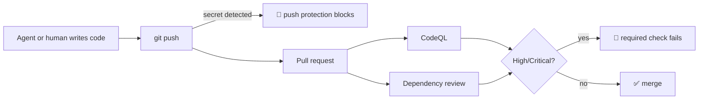

# Expert Lab 5 — GitHub Advanced Security on the IaC Repo

**Time**: 60 min · **Prerequisite**: Lab 1

**Source**: [JoranBergfeld/ghas-defender-example](https://github.com/JoranBergfeld/ghas-defender-example)
— read its `README.md` and `docs/DEMO.md`, and use `.github/workflows/backend-ci.yml`,
`.github/codeql-config.yml`, `.github/dependabot.yml` and `scripts/setup-repo.sh` as reference implementations.

## Objective

Vulnerabilities and secrets are caught **before** they reach `main`, and the pipeline blocks them
automatically — not as a report someone reads later.

## 1. Enable the features (10 min)

In repository **Settings → Advanced Security**, enable:

- [ ] **Secret scanning** and **push protection**
- [ ] **Code scanning** (CodeQL)
- [ ] **Dependency graph** and **Dependabot alerts** + **security updates**

`ghas-defender-example`'s `scripts/setup-repo.sh` does all of this with the `gh` CLI — a good
model if you want it reproducible rather than clicked.

## 2. CodeQL in CI (15 min)

Add a CodeQL workflow. Your IaC repo has at least two analysable languages:

- **`actions`** — scans your workflow YAML itself (see `infra.yml` in the reference repo)
- **`javascript`/`java`/etc.** — whichever the Contoso Ticketing app is written in

Add a `.github/codeql-config.yml` to scope paths and query suites.

✅ **Checkpoint**: a CodeQL run appears under the **Security** tab.

## 3. Fail the build on high severity (10 min)

Alerts nobody blocks on are decoration. The reference `backend-ci.yml` parses the CodeQL SARIF and
**fails the job** when any finding has `security-severity >= 7.0` (High/Critical). Implement the
same gate.

Then prove it. On a branch, introduce a deliberate vulnerability — the reference repo's
`scripts/seed-vulnerabilities.md` documents good candidates, such as SQL injection through string
concatenation. Open a PR.

✅ **Checkpoint**: the PR is blocked by a failing CodeQL check. Revert the vulnerability; the PR goes green.

## 4. Push protection (10 min)

Commit a realistic-looking credential to a branch and push it.

✅ **Checkpoint**: GitHub **blocks the push** before the secret reaches the repository.

Discuss: your baseline uses managed identity precisely so this class of secret does not exist.
Push protection is the backstop for when someone — or some agent — reaches for a connection string anyway.

## 5. Dependency review and Dependabot (5 min)

- [ ] `actions/dependency-review-action@v4` runs on pull requests
- [ ] `.github/dependabot.yml` covers every ecosystem in the repo, including `github-actions`

## 6. Make it required (10 min)

Extend the branch protection from Lab 1 on `main`:

- [ ] CodeQL is a **required** status check
- [ ] `infra-ci` is a **required** status check
- [ ] Secret scanning push protection is enabled and not bypassable without a documented reason

---

## Definition of Done

- [ ] Secret scanning + push protection, code scanning, dependency graph and Dependabot all enabled
- [ ] CodeQL runs in CI over both `actions` and the application language
- [ ] A High/Critical finding **fails** the PR — demonstrated, then reverted
- [ ] A pushed secret was **blocked** — demonstrated
- [ ] `main` requires both CodeQL and `infra-ci`

➡️ Next: [Lab 6 — Defender for Cloud & code-to-cloud](lab-06-defender.md)
