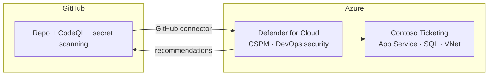

# Expert Lab 6 — Microsoft Defender for Cloud and Code-to-Cloud

**Time**: 60 min · **Prerequisite**: [Lab 5 — GHAS on the IaC repo](lab-05-ghas.md)

This lab is **self-contained**: the Defender plans, the GitHub connector and the deny policies are
all things you author yourself in [`infra/`](../../infra/), following the module conventions already
used by [`infra/main.bicep`](../../infra/main.bicep). No other repository needs to exist.

## Objective

GHAS knows what is **in the code**. Defender for Cloud knows what is **running**. Connect them so a
finding in a repository can be traced to the live resource it endangers — and vice versa.



## 1. Enable Defender plans as code (20 min)

Do **not** click this on. Add it to [`infra/`](../../infra/) so it is part of the desired state from
[Lab 2](lab-02-desired-state.md). Have your
[`@implementer`](../../.github/agents/implementer.agent.md) agent write
`infra/modules/defender.bicep` — a subscription-scoped module setting
`Microsoft.Security/pricings` — enabling at minimum:

- [ ] **Defender CSPM** — posture management and attack-path analysis
- [ ] **Defender for App Service** — your compute tier
- [ ] **Defender for SQL** (Azure SQL database servers) — your data tier
- [ ] **Defender for Storage** if you added any
- [ ] **DevOps security** — required for the GitHub connector

> 💡 Defender plans are billed per resource. Confirm the budget with your coaches, and note the
> cleanup step at the end of this lab.

Validate in **Bash with the Azure CLI**, from the **repository root** (dev container, local VS Code
or Cloud Shell — see [Execution Environments](../concepts/environment-options.md)):

```bash
./scripts/validate-infra.sh
```

Then deploy at subscription scope:

```bash
az deployment sub create \
  --name ticketing-baseline \
  --location swedencentral \
  --template-file infra/main.bicep \
  --parameters infra/main.bicepparam
```

✅ **Checkpoint**: Defender for Cloud shows a secure score for your subscription.

## 2. Connect GitHub to Defender for Cloud (15 min)

Author `infra/modules/githubConnector.bicep` (a `Microsoft.Security/securityConnectors` resource of
kind `GitHub`) and deploy it with the same `az deployment sub create` command as above. Then
complete the **one-time OAuth authorisation** in **Azure portal → Microsoft Defender for Cloud →
Environment settings → your GitHub connector → Authorize** — the connector cannot finish without it.

✅ **Checkpoint**: **Defender for Cloud → DevOps security** lists your repository, and its GHAS
findings appear as Azure security recommendations.

## 3. Read your posture (10 min)

Work through the recommendations for the Contoso Ticketing resource group as a team:

| Question | Answer |
|---|---|
| What is the secure score? | |
| Highest-severity recommendation? | |
| Any attack path from internet to the SQL database? | |
| Does Defender agree the SQL server is not publicly exposed? | |

If Defender flags something your [desired-state contract](lab-02-desired-state.md) says is fine,
one of the two is wrong. Decide which, and update it.

## 4. Code-to-cloud correlation (10 min)

This is the money moment. Take the SQL injection from
[the shared contract](../concepts/fault-and-vulnerability.md) that Lab 5 raised, put it back on a
branch, and trace it forward:

1. GHAS raises the finding in the repository.
2. The Defender GitHub connector surfaces it as a DevOps security recommendation in Azure.
3. Defender ties that recommendation to the **running** `app-ticketing-…` and `sql-ticketing-…`
   resources — the same application code the beginner and intermediate tracks deployed.

Now you can answer the question neither tool answers alone: *does this code vulnerability actually
put a live, internet-reachable resource at risk?* That is what turns a backlog into a priority order.

Remove the deliberate vulnerability afterwards.

## 5. Prevention, not just detection (5 min)

Extend the Azure Policy work from [Lab 2](lab-02-desired-state.md) with a Defender-driven deny. The
Contoso Ticketing stack is PaaS, so the control point is **resource admission** — the deployment
itself is refused. Deploy at least one **deny** policy for your tier, for example:

- deny `Microsoft.Sql/servers` where `publicNetworkAccess` is not `Disabled`
- deny `Microsoft.Sql/servers` without vulnerability assessment enabled
- deny `Microsoft.Web/sites` where `httpsOnly` is false or `minTlsVersion` is below `1.2`

Prove it the same way [Lab 5](lab-05-ghas.md) proved the CodeQL gate: attempt the non-compliant deployment from a
branch and confirm the deployment is **denied**, not merely flagged. Then revert.

## 6. Cleanup

Defender plans cost money. Unless your coaches say otherwise, disable the plans you enabled at the
end of the hackathon — by redeploying your template with them turned off, so cleanup is also
desired-state driven.

---

## Definition of Done

- [ ] Defender plans enabled **as code** in [`infra/`](../../infra/), including DevOps security
- [ ] GitHub connector deployed and authorised; your repository is listed under DevOps security
- [ ] The posture questionnaire above is answered and any conflict with the desired-state contract is resolved
- [ ] The SQL injection was traced end-to-end from the repository to the running App Service and SQL server, then fixed
- [ ] At least one preventive **deny** policy exists and was demonstrated blocking a non-compliant deployment
- [ ] Cleanup plan agreed

➡️ Next: [Lab 7 — Close the loop](lab-07-close-the-loop.md)
