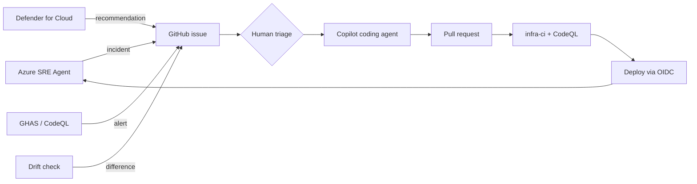

# Expert Lab 7 — Close the Loop

**Time**: 45 min · **Prerequisite**: Labs 1–6

You now have a pipeline that builds the workload and two systems that watch it. This lab connects
them, so operational and security signals become **agent work items** rather than a dashboard
nobody opens.

## Objective

Every reliability and security finding has a defined, largely automated path back into the agentic
pipeline — with a deliberate human gate in exactly the right place.

## 1. Map every signal (15 min)

Create `docs/feedback-loops.md` and fill in this table for your implementation:

| Signal source | Trigger | Lands as | Handled by | Human gate |
|---|---|---|---|---|
| Azure SRE Agent | Alert → investigation | Structured GitHub issue | Copilot coding agent | Approve handover |
| Drift check (Lab 2) | Scheduled what-if diff | GitHub issue | `@implementer` agent | PR review |
| CodeQL (Lab 5) | High/Critical finding | Failed check + alert | Copilot autofix / `@implementer` | PR review |
| Secret scanning | Push protection block | Blocked push | Developer | Immediate |
| Defender for Cloud (Lab 6) | New recommendation | | | |
| Dependabot | Vulnerable dependency | PR | Automated | PR review |

Any row where the "handled by" column says *nobody* is a gap. Fix it or write down why it is acceptable.

## 2. Add the missing agent (15 min)

Your day-1 agents were built for greenfield. Day-2 needs one more: an agent that takes a finding
(incident, drift, or security recommendation), determines whether the fix belongs in the template,
the application or the runtime, and routes it accordingly.

Create `.github/agents/sre.agent.md` — see the reference version in
[`.github/agents/`](../../.github/agents/) if you get stuck. It should:

- read `docs/desired-state.md`, `docs/operations-runbook.md` and `knowledge/`
- classify the finding
- hand off to `@implementer` for template fixes, and always insist the **template** is fixed, not just the live resource
- refuse to fix a symptom without recording the root cause

Prove it on a real finding from Lab 4 or Lab 6.

## 3. Decide where the humans stand (10 min)

Agree as a team, and record in `docs/feedback-loops.md`:

| Action | Autonomous | Approval required | Never automated |
|---|---|---|---|
| Restart a stuck app | | | |
| Scale out under load | | | |
| Revert a configuration drift | | | |
| Merge a Copilot PR to `infra/` | | | |
| Change a network rule | | | |
| Disable a Defender plan | | | |

Defend your choices in the debrief. "Everything requires approval" is as wrong an answer as "nothing does".

## 4. Present (5 min)

Ten minutes, live:

1. The workload and how you built it agentically
2. One incident, end to end, from alert to merged fix
3. One security finding, traced from code to cloud
4. Your feedback-loop table and where you put the human gates
5. The single thing you would automate next, and the single thing you never would

---

## Definition of Done

- [ ] `docs/feedback-loops.md` maps every signal source with no unowned rows
- [ ] An operations agent exists and has been used on a real finding
- [ ] The autonomy matrix is agreed and written down
- [ ] The presentation is ready

🎉 That completes the expert track. Check the
[expert definition of done](../tracks/expert.md#definition-of-done) before you present.
