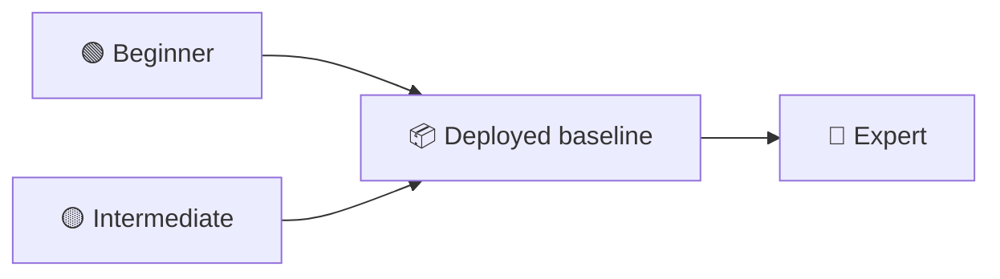

# Choose Your Track

All three tracks deliver the **same** workload — the [Contoso Ticketing baseline](../concepts/workload.md). They differ in *how agentically* you build it and how far into day-2 you go.



## Pick by where you are today

| If your team… | Start at | Guide |
|---|---|---|
| has used Copilot Chat but never written a custom agent, prompt or skill | 🟢 Beginner | [beginner.md](beginner.md) |
| already writes custom agents and prompts, and wants to know what `/plan`, `/fleet` and subagents change | 🟡 Intermediate | [intermediate.md](intermediate.md) |
| ships IaC agentically already and wants day-2: reliability and security | 🔴 Expert | [expert.md](expert.md) |

## Rolling up

Beginner and intermediate teams that finish early **continue into the expert track** using their own deployment — no reset, no redesign. Complete the [handover checklist](../concepts/rollup-checklist.md) first; it verifies your deployment matches the baseline contract the expert labs assume.

## Participant deployment preflight

Work in a fork owned by your team and deploy to your own subscription. Before creating resources:

1. In `infra/main.bicepparam`, choose a unique `workload` or `environment` token and your SRE-Agent
   region. This produces unique CAF resource names.
2. Replace the sample SQL administrator object ID and login with a Microsoft Entra group or user in
   your tenant. The group/user must be able to sign in to Azure SQL for the one-time bootstrap.
3. Confirm the signed-in subscription is yours: `az account show -o table`.
4. Decide where each action runs:

| Action | Cloud Shell, Copilot CLI or VS Code terminal | Private-network-connected host |
|---|---|---|
| Validate, what-if, deploy Bicep and publish the app | ✅ | ✅ |
| Run `bootstrap-ticketing-database.sh` | Usually no | ✅ Required |
| Verify public app routes | ✅ | ✅ |

Cloud Shell is not normally connected to your workload VNet, so it cannot resolve the SQL private
endpoint. Do not enable SQL public access to work around this boundary.

Teams starting directly at expert deploy the reference baseline in one command:

```bash
az deployment sub create \
  --name ticketing-baseline \
  --location swedencentral \
  --template-file infra/main.bicep \
  --parameters infra/main.bicepparam

# Run from a host connected to the SQL private endpoint as the configured Entra SQL administrator.
./scripts/bootstrap-ticketing-database.sh --deployment-name ticketing-baseline
```

…then deploy the shared application onto it:

```bash
dotnet publish src/ContosoTicketing -c Release -o /tmp/publish
cd /tmp/publish && zip -r ../app.zip . && cd -
az webapp deploy --resource-group rg-ticketing-dev-swedencentral \
  --name app-ticketing-dev-swedencentral --src-path /tmp/app.zip --type zip
```

Finally, run `./scripts/bootstrap-ticketing-database.sh --deployment-name ticketing-baseline` from
the private-network-connected host as the configured Entra SQL administrator. The expected
end state is `/healthz`, `/readyz` and `/api/tickets` returning `200`, with SQL still private.

## Scoring

Every track is scored on the same three axes:

| Axis | Weight | What coaches look for |
|---|---|---|
| **Workload correctness** | 40% | The [acceptance criteria](../concepts/workload.md#acceptance-criteria) all pass |
| **Agentic maturity** | 40% | Quality of agents, handovers, and how much of the work the agents genuinely did |
| **Evidence** | 20% | Architecture, plan, test results and runbook exist and are current |

Expert teams get two extra axes: **reliability** (SRE Agent labs) and **security** (GHAS + Defender labs).
