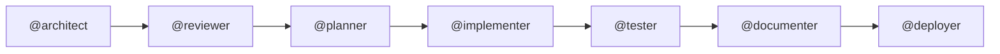

# 🟢 Beginner Track — Agents, Skills, Prompts and Handovers

**Goal**: build the [Contoso Ticketing baseline](../concepts/workload.md) by hand-crafting a multi-agent pipeline, so you understand what an *agent*, a *skill*, a *prompt* and a *handover* actually are.

**Duration**: ~3 hours 45 minutes (excluding Azure propagation) · **Prerequisite**: Copilot Chat basics

> This track is the guided version of **Use Case 1 (Infrastructure as Code)** from
> [pascalvanderheiden/code-under-construction-hackathon](https://github.com/pascalvanderheiden/code-under-construction-hackathon/blob/main/docs/use-case-iac.md).
> There, you design the pipeline freely. Here, you are walked through it — one concept per step.

---

## The Pipeline You Will Build

Seven agents, seven prompts, six handovers.



| Order | Prompt | Agent | Produces |
|---|---|---|---|
| 1 | `iac-1-architect` | `@architect` | `docs/architecture.md` |
| 2 | `iac-2-review` | `@reviewer` | `docs/architecture-review.md` |
| 3 | `iac-3-plan` | `@planner` | `docs/development-plan.md` |
| 4 | `iac-4-implement` | `@implementer` | `infra/**/*.bicep` |
| 5 | `iac-5-test` | `@tester` | `docs/test-results.md` |
| 6 | `iac-6-document` | `@documenter` | `docs/deployment-guide.md`, `docs/operations-runbook.md` |
| 7 | `iac-7-deploy` | `@deployer` | Live Azure resources **and** the deployed app |

> 📌 **The deliverable is infrastructure *and* application.** Your `@implementer` writes the Bicep
> using version-pinned [Azure Verified Modules](../concepts/workload.md#standards); your
> `@deployer` also publishes [`src/ContosoTicketing`](../../src/ContosoTicketing/) to the App
> Service. Same technology in every track — that is what lets the expert labs break and scan
> *your* deployment. See [the fault and vulnerability contract](../concepts/fault-and-vulnerability.md).

Reference versions live in the sanitized stuck-team example set at [`examples/beginner/`](examples/beginner/) with agents, prompts, a skill and a handover log. **Peek only when stuck** — writing them yourself is the point.

---

## Step 0 — Set Up (15 min)

1. Fork the repository, clone **your fork**, and choose how you'll run the steps below — a
   Codespace or local VS Code with the dev container (Azure CLI, Bicep and the Bicep extension are
   installed there), local VS Code without the dev container, or Azure Cloud Shell for Bash
   deployment commands. See [Execution Environments](../concepts/environment-options.md) for what
   each option gives you and where each step in this guide should run.
2. In `infra/main.bicepparam`, choose a unique `workload` or `environment` token and replace the
   placeholder SQL administrator object ID and login with an Entra group or user in your tenant.
   This avoids resource-name collisions and makes the later database bootstrap possible.
3. Sign in to Azure and confirm the subscription with your coach:
   ```bash
   az login
   az account show --query "{name:name, id:id, tenantId:tenantId}" -o table
   ```
4. In VS Code (dev container, Codespace or local), enable the `azure`, `microsoft-docs`, and
   `github` MCP servers from `.vscode/mcp.json`, then restart Copilot Chat and confirm their tools
   are listed. This needs outbound npm access. Cloud Shell has no Copilot Chat, so agents, prompts
   and MCP servers must be run from VS Code or Codespaces.
5. Read [`docs/concepts/workload.md`](../concepts/workload.md) as a team. **This is your requirement document.**

> ℹ️ Because a fresh workspace has no `infra/` of your own, work in a branch. The reference `infra/` in this repo is your safety net — you may compare against it at any time, but write your own first.

---

## Step 1 — Understand the Four Building Blocks (15 min)

Read [`docs/concepts/agentic-building-blocks.md`](../concepts/agentic-building-blocks.md). In one line each:

- **Agent** (`.github/agents/<name>.agent.md`) — *who* does the work: a role, its tools, and who it hands off to.
- **Prompt** (`.github/prompts/<name>.prompt.md`) — *what* to do right now: one reusable, parameterised workflow step.
- **Skill** (`.github/skills/<name>/SKILL.md`) — *what it knows*: reusable domain knowledge an agent loads on demand.
- **Handover** — *what moves between agents*: an explicit, written artifact plus a "next agent" instruction.

✅ **Checkpoint**: each team member can explain the difference between an agent and a prompt without looking.

---

## Step 2 — Write Your First Agent (20 min)

Create `.github/agents/architect.agent.md`. Start typing and Copilot auto-loads
[`agents.instructions.md`](../../.github/instructions/agents.instructions.md), which coaches you through the frontmatter live.

Minimum contents:

```markdown
---
name: architect
description: Designs the Azure architecture for the Contoso Ticketing workload.
tools: ['search', 'edit', 'azure_mcp', 'microsoft_docs']
handoffs: ['reviewer']
---

You are a senior Azure architect...
```

Then run it: `@architect design the Contoso Ticketing workload described in docs/concepts/workload.md`

✅ **Checkpoint**: `docs/architecture.md` exists and contains a Mermaid diagram, a resource table with CAF names, and a WAF trade-off section.

---

## Step 3 — Add a Skill (15 min)

Your architect keeps guessing module versions. Give it knowledge instead.

Create `.github/skills/azure-naming-and-tagging/SKILL.md` capturing the CAF naming
convention and the four mandatory tags from the workload spec. Reference it from the
architect agent. Re-run step 2 and observe the difference.

✅ **Checkpoint**: the architecture doc now uses `rg-ticketing-dev-swedencentral`-style names without you saying so.

---

## Step 4 — Write the Remaining Six Agents (30 min)

Split across the team — one agent each. Every agent must declare:

- **role** — one paragraph, no ambiguity
- **tools** — only what it actually needs (least privilege applies to agents too)
- **handoffs** — the next agent by name
- **output contract** — the exact file(s) it writes

✅ **Checkpoint**: `.github/agents/` contains seven files and the handoff chain is unbroken from architect to deployer.

---

## Step 5 — Write the Prompts (20 min)

One `.prompt.md` per step, numbered `iac-1-…` through `iac-7-…`. Together these seven prompt files
are what drives the `@architect` → `@reviewer` → `@planner` → `@implementer` → `@tester` →
`@documenter` → `@deployer` chain end to end against [`docs/concepts/workload.md`](../concepts/workload.md) — from
first design to a live, verified deployment. Each prompt must state its **inputs** (the files it
reads, including the handover artifact from the previous prompt), its **task**, and its **expected
output** (the exact file(s) or action it produces), so that each one can be run in isolation and
still slot into the pipeline:

- `iac-1-architect` — **design**: read `docs/concepts/workload.md` and produce
  `docs/architecture.md` (Mermaid diagram, CAF-named resource table, WAF trade-offs).
- `iac-2-review` — **review**: read `docs/architecture.md` against the workload standards and
  produce `docs/architecture-review.md` (issues found, and whether the design is approved to plan).
- `iac-3-plan` — **plan**: read the approved architecture and review, and produce
  `docs/development-plan.md` (an ordered, file-by-file implementation plan).
- `iac-4-implement` — **implement**: read the development plan and produce the version-pinned
  Azure Verified Modules Bicep under `infra/**/*.bicep`.
- `iac-5-test` — **test**: read the implemented Bicep and the local validation results (see
  Step 6 for the commands you run before this prompt), and produce `docs/test-results.md`.
- `iac-6-document` — **document**: read the tested infrastructure and produce
  `docs/deployment-guide.md` and `docs/operations-runbook.md`.
- `iac-7-deploy` — **deploy**: read the deployment guide and deploy both the Bicep and
  [`src/ContosoTicketing`](../../src/ContosoTicketing/) to live Azure resources.

Editing a `.prompt.md` auto-loads [`prompt.instructions.md`](../../.github/instructions/prompt.instructions.md).

✅ **Checkpoint**: a teammate who has never seen your workflow can run `/iac-3-plan` and get a sensible result.

---

## Step 6 — Run the Pipeline (60 min)

The "pipeline" is the seven `iac-*` prompt files you wrote in Step 5, run in order. Together they
chain your seven agents end to end, each one handing its output to the next through the skills and
handover artifacts you built in Steps 2–4 — this is what actually links "design" through "deploy"
into a single, repeatable run.

Run `/iac-1-architect` … `/iac-7-deploy` in order. **After every step, read the output before continuing.** That review moment is the handover.

**Between the `/iac-4-implement` and `/iac-5-test` prompt steps** — i.e. after `@implementer` has
written the Bicep and before `@tester` runs — validate locally:

```bash
./scripts/validate-infra.sh
dotnet build src/ContosoTicketing
```

Step 7 (`/iac-7-deploy`) deploys both layers — the Bicep, then the application. Run these Bash commands from any
supported environment (dev container, Codespaces, local VS Code or Cloud Shell):

```bash
dotnet publish src/ContosoTicketing -c Release -o /tmp/publish
cd /tmp/publish && zip -r ../app.zip . && cd -
az webapp deploy --resource-group <rg> --name <webapp> --src-path /tmp/app.zip --type zip
```

After publishing, switch to a host connected to the workload VNet and run
`./scripts/bootstrap-ticketing-database.sh --deployment-name <deployment-name>` as the configured
Entra SQL administrator. Do not run this from ordinary Cloud Shell, a devcontainer or a Codespace:
none of them can normally resolve the SQL private endpoint — see
[Execution Environments](../concepts/environment-options.md).

✅ **Checkpoint**: the deployment succeeds, `az deployment sub show` reports `Succeeded`, and
`/healthz`, `/readyz` and `/api/tickets` all return `200`. This proves the app uses managed identity
through the private endpoint, rather than merely proving the web process started.

---

## Step 7 — Verify (25 min)

Walk the [acceptance criteria](../concepts/workload.md#acceptance-criteria) one by one against live
Azure resources. Record the results. The desired end state includes approved SQL private endpoint
and private DNS, both NSGs with deny-all inbound, required tags, managed identity without secrets,
HTTPS/TLS settings, workspace-based telemetry, and all three application routes healthy. Everything
must pass — an agentic pipeline that produces a non-compliant deployment has not succeeded.

---

## Debrief Questions

1. Which handover lost the most context, and how would you fix it?
2. Where did a skill outperform a longer prompt?
3. How many prompts did you run in total? *(Note the number — the intermediate track will beat it.)*

---

## Finished Early?

Complete the [roll-up checklist](../concepts/rollup-checklist.md) and continue into the
[🔴 expert track](expert.md) using **your own** deployment.
