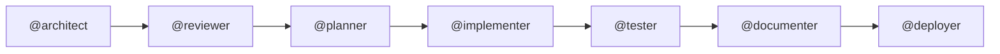

# 🟢 Beginner Track — Agents, Skills, Prompts and Handovers

**Goal**: build the [Contoso Ticketing baseline](../concepts/workload.md) by hand-crafting a multi-agent pipeline, so you understand what an *agent*, a *skill*, a *prompt* and a *handover* actually are.

**Duration**: ~4 hours · **Prerequisite**: Copilot Chat basics

> This track is the guided version of **Use Case 1 (Infrastructure as Code)** from
> [bram-boer/code-under-construction-hackathon](https://github.com/bram-boer/code-under-construction-hackathon/blob/main/docs/use-case-iac.md).
> There, you design the pipeline freely. Here, you are walked through it — one concept per step.

---

## The Pipeline You Will Build

Seven agents, seven prompts, six handovers.



| Step | Prompt | Agent | Produces |
|---|---|---|---|
| 1 | `iac-1-architect` | `@architect` | `docs/architecture.md` |
| 2 | `iac-2-review` | `@reviewer` | `docs/architecture-review.md` |
| 3 | `iac-3-plan` | `@planner` | `docs/development-plan.md` |
| 4 | `iac-4-implement` | `@implementer` | `infra/**/*.bicep` |
| 5 | `iac-5-test` | `@tester` | `docs/test-results.md` |
| 6 | `iac-6-document` | `@documenter` | `docs/deployment-guide.md`, `docs/operations-runbook.md` |
| 7 | `iac-7-deploy` | `@deployer` | Live Azure resources **and** the deployed app |

> 📌 **The deliverable is infrastructure *and* application.** Your `@implementer` writes the Bicep
> using version-pinned [Azure Verified Modules](../concepts/workload.md#standards); your
> `@deployer` also publishes [`src/ContosoTicketing`](../../src/ContosoTicketing/) to the App
> Service. Same technology in every track — that is what lets the expert labs break and scan
> *your* deployment. See [the fault and vulnerability contract](../concepts/fault-and-vulnerability.md).

Reference versions of all of these live in [`.github/agents/`](../../.github/agents/) and [`.github/prompts/`](../../.github/prompts/). **Peek only when stuck** — writing them yourself is the point.

---

## Step 0 — Set Up (20 min)

1. Open the repo in **Codespaces** (or VS Code with the devcontainer). Tools install automatically.
2. Sign in to Azure and confirm the subscription with your coach:
   ```bash
   az login
   az account show --query "{name:name, id:id, tenantId:tenantId}" -o table
   ```
3. Open `.vscode/mcp.json` and start the **Azure MCP** and **Learn MCP** servers. Confirm in Copilot Chat that the tools are listed.
4. Read [`docs/concepts/workload.md`](../concepts/workload.md) as a team. **This is your requirement document.**

> ℹ️ Because a fresh workspace has no `infra/` of your own, work in a branch. The reference `infra/` in this repo is your safety net — you may compare against it at any time, but write your own first.

---

## Step 1 — Understand the Four Building Blocks (20 min)

Read [`docs/concepts/agentic-building-blocks.md`](../concepts/agentic-building-blocks.md). In one line each:

- **Agent** (`.github/agents/<name>.agent.md`) — *who* does the work: a role, its tools, and who it hands off to.
- **Prompt** (`.github/prompts/<name>.prompt.md`) — *what* to do right now: one reusable, parameterised workflow step.
- **Skill** (`.github/skills/<name>/SKILL.md`) — *what it knows*: reusable domain knowledge an agent loads on demand.
- **Handover** — *what moves between agents*: an explicit, written artifact plus a "next agent" instruction.

✅ **Checkpoint**: each team member can explain the difference between an agent and a prompt without looking.

---

## Step 2 — Write Your First Agent (30 min)

Create `.github/agents/architect.agent.md`. Start typing and Copilot auto-loads
[`agents.instructions.md`](../../.github/instructions/agents.instructions.md), which coaches you through the frontmatter live.

Minimum contents:

```markdown
---
name: architect
description: Designs the Azure architecture for the Contoso Ticketing workload.
tools: ['search', 'edit', 'azure_mcp', 'microsoft_docs']
handoffs: ['reviewer']
---

You are a senior Azure architect...
```

Then run it: `@architect design the Contoso Ticketing workload described in docs/concepts/workload.md`

✅ **Checkpoint**: `docs/architecture.md` exists and contains a Mermaid diagram, a resource table with CAF names, and a WAF trade-off section.

---

## Step 3 — Add a Skill (20 min)

Your architect keeps guessing module versions. Give it knowledge instead.

Create `.github/skills/azure-naming-and-tagging/SKILL.md` capturing the CAF naming
convention and the four mandatory tags from the workload spec. Reference it from the
architect agent. Re-run step 2 and observe the difference.

✅ **Checkpoint**: the architecture doc now uses `rg-ticketing-dev-swedencentral`-style names without you saying so.

---

## Step 4 — Write the Remaining Six Agents (45 min)

Split across the team — one agent each. Every agent must declare:

- **role** — one paragraph, no ambiguity
- **tools** — only what it actually needs (least privilege applies to agents too)
- **handoffs** — the next agent by name
- **output contract** — the exact file(s) it writes

✅ **Checkpoint**: `.github/agents/` contains seven files and the handoff chain is unbroken from architect to deployer.

---

## Step 5 — Write the Prompts (30 min)

One `.prompt.md` per step, numbered `iac-1-…` through `iac-7-…`. Each prompt states its **inputs** (files to read), its **task**, and its **expected output**. Editing a `.prompt.md` auto-loads [`prompt.instructions.md`](../../.github/instructions/prompt.instructions.md).

✅ **Checkpoint**: a teammate who has never seen your workflow can run `/iac-3-plan` and get a sensible result.

---

## Step 6 — Run the Pipeline (60 min)

Run `/iac-1-architect` … `/iac-7-deploy` in order. **After every step, read the output before continuing.** That review moment is the handover.

Between steps 4 and 5, validate locally:

```bash
./scripts/validate-infra.sh
dotnet build src/ContosoTicketing
```

Step 7 deploys both layers — the Bicep, then the application:

```bash
dotnet publish src/ContosoTicketing -c Release -o /tmp/publish
cd /tmp/publish && zip -r ../app.zip . && cd -
az webapp deploy --resource-group <rg> --name <webapp> --src-path /tmp/app.zip --type zip
```

✅ **Checkpoint**: the deployment succeeds, `az deployment sub show` reports `Succeeded`, and
`curl https://<webapp>/healthz` returns `200`.

---

## Step 7 — Verify (25 min)

Walk the [acceptance criteria](../concepts/workload.md#acceptance-criteria) one by one. Everything must pass — an agentic pipeline that produces a non-compliant deployment has not succeeded.

---

## Debrief Questions

1. Which handover lost the most context, and how would you fix it?
2. Where did a skill outperform a longer prompt?
3. How many prompts did you run in total? *(Note the number — the intermediate track will beat it.)*

---

## Finished Early?

Complete the [roll-up checklist](../concepts/rollup-checklist.md) and continue into the
[🔴 expert track](expert.md) using **your own** deployment.
