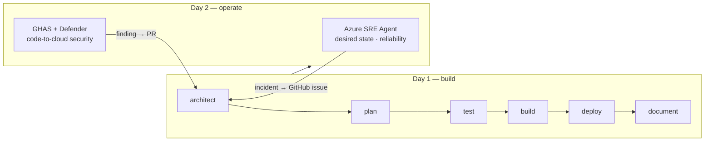

# 🔴 Expert Track — Reliable and Secure by Design

**Goal**: take the deployed [Contoso Ticketing baseline](../concepts/workload.md) from "it deployed" to "it stays healthy and it is secure end-to-end" — infrastructure that is architected, planned, tested, built, deployed **and documented**, kept in a desired, reliable state by the **Azure SRE Agent**, and protected code-to-cloud by **GHAS + Microsoft Defender for Cloud**.

**Duration**: ~4 hours for a team running the reliability and security lanes in parallel; ~6 hours solo · **Prerequisite**: a deployed baseline

---

## Start Here

**Rolling up from beginner or intermediate?** Complete the [roll-up checklist](../concepts/rollup-checklist.md) — it verifies your deployment exposes what the labs below assume — then go to Lab 1.

> Run the commands below from a devcontainer/Codespace, local VS Code or Azure Cloud Shell — see
> [Execution Environments](../concepts/environment-options.md) for what each option gives you.

**Starting fresh at expert?** Deploy the reference baseline in one command and go to Lab 1:

```bash
az deployment sub create \
  --name ticketing-baseline \
  --location swedencentral \
  --template-file infra/main.bicep \
  --parameters infra/main.bicepparam
```

Then deploy the application, which Labs 3–6 alert on, break and scan:

```bash
dotnet publish src/ContosoTicketing -c Release -o /tmp/publish
cd /tmp/publish && zip -r ../app.zip . && cd -
az webapp deploy --resource-group rg-ticketing-dev-swedencentral \
  --name app-ticketing-dev-swedencentral --src-path /tmp/app.zip --type zip
```

Then, from a host connected to the workload VNet, run the one-time bootstrap as the configured
Microsoft Entra SQL administrator:

```bash
./scripts/bootstrap-ticketing-database.sh --deployment-name ticketing-baseline
```

Ordinary Cloud Shell, and a devcontainer/Codespace by default, cannot normally reach the SQL
private endpoint — see [Execution Environments](../concepts/environment-options.md). The starting
state is ready
only when `/healthz`, `/readyz` and `/api/tickets` return `200`, Application Insights receives
telemetry, and the SQL server remains private. Use the [roll-up checklist](../concepts/rollup-checklist.md)
to record the resource names and prove this same state before starting either lane.

> 🌍 Deploy in `swedencentral`, `eastus2` or `australiaeast` — the Azure SRE Agent is not available everywhere.

> 📌 Labs 4–6 use one reproducible fault and one reproducible vulnerability, both defined in
> [`docs/concepts/fault-and-vulnerability.md`](../concepts/fault-and-vulnerability.md). Read it
> before Lab 3 so you know what the alerts and scans are aiming at.

---

## The Full Lifecycle



The loop back is the point: day-2 signals become day-1 work items, handled by agents.

If the handover loop is unclear, inspect the sanitized examples in [`examples/expert/`](examples/expert/). They show participant-style SRE triage, remediation planning, security review, operations skills and issue handovers without live environment values.

---

## Labs

| # | Lab | Focus | Time |
|---|---|---|---|
| 1 | [Lifecycle hardening](../expert/lab-01-lifecycle.md) | Make the pipeline itself testable, repeatable and documented; CI on every PR | 35 min |
| 2 | [Desired state & drift](../expert/lab-02-desired-state.md) | What-if as a drift detector; guard rails via Azure Policy | 25 min |
| 3 | [Onboard the Azure SRE Agent](../expert/lab-03-sre-agent.md) | Connect the SRE Agent to the resource group and to GitHub | 35 min |
| 4 | [Incident → agent handover](../expert/lab-04-incident-handover.md) | Inject a fault, watch SRE Agent investigate, approve the handover to Copilot, ship the fix | 50 min |
| 5 | [GHAS on the IaC repo](../expert/lab-05-ghas.md) | CodeQL, secret scanning + push protection, dependency review, branch protection | 35 min |
| 6 | [Defender for Cloud & code-to-cloud](../expert/lab-06-defender.md) | Defender plans, the GitHub connector, correlating a GHAS finding with the running workload | 40 min |
| 7 | [Close the loop](../expert/lab-07-close-the-loop.md) | Route reliability and security findings back into the agentic pipeline | 25 min |

Labs 1–2 are prerequisites for the rest. Run Labs 3–4 (reliability) and 5–6 (security) in parallel
after Lab 2, then reconvene for Lab 7. Azure and GitHub propagation can take longer than the
hands-on time; while waiting, complete the evidence and review tasks rather than extending the lab.

---

## Sources

These labs are deliberately thin wrappers that point at the canonical material and adapt it to the Contoso Ticketing workload:

| Lab | Upstream source |
|---|---|
| 3, 4 | [JoranBergfeld/sre-agent-workshop](https://github.com/JoranBergfeld/sre-agent-workshop) — in particular the `cloud-agent-handover` scenario (App Service, low cost) |
| 5, 6 | [JoranBergfeld/ghas-defender-example](https://github.com/JoranBergfeld/ghas-defender-example) |

Use them as reference implementations, not as copy-paste targets — the point is to apply the pattern to **your** workload.

---

## Definition of Done

- [ ] Architecture, plan, test results, deployment guide and operations runbook exist and match the deployed reality
- [ ] `infra-ci` runs on every PR: `bicep build`, `bicep lint`, `what-if`
- [ ] A drift check exists and demonstrably detects a manual portal change
- [ ] The Azure SRE Agent is onboarded to the workload's resource group and connected to this GitHub repo
- [ ] An injected incident produced an SRE Agent investigation, an approved remediation, and a GitHub issue
- [ ] That issue was handed to Copilot, which produced a PR that CI validated and deployed
- [ ] CodeQL, secret scanning with push protection, dependency review and Dependabot are on; `main` is protected and CodeQL is a required check
- [ ] Defender for Cloud plans are enabled and the GitHub connector correlates a repository finding with the running workload
- [ ] A written explanation of how reliability and security findings feed back into the agentic pipeline

---

## Debrief Questions

1. Which failure did the SRE Agent handle better than a human on-call would have — and which one worse?
2. Where should the approval gate sit, and why not further left or right?
3. What did code-to-cloud correlation tell you that neither GHAS nor Defender knew alone?
4. Which of your day-1 agents needs to change now that day-2 signals feed it?
