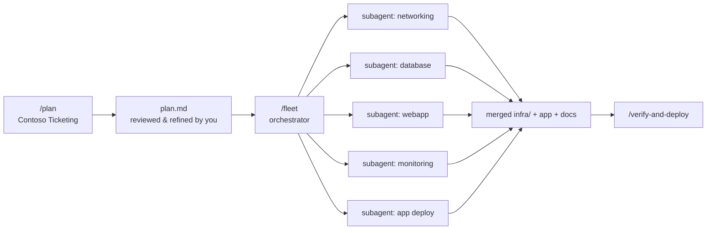

# 🟡 Intermediate Track — Same Result, Far Fewer Prompts

**Goal**: deliver the *same* [Contoso Ticketing baseline](../concepts/workload.md) as the beginner track, but using the latest Copilot capabilities — **plan mode (`/plan`)**, **agent fleets (`/fleet`)**, custom agents and background sessions — so the pipeline collapses from ~7 prompts to ~3.

**Duration**: ~3 hours 45 minutes (excluding Azure propagation) · **Prerequisite**: the beginner track, or you already write custom agents and prompts

---

## The Shift

| | 🟢 Beginner | 🟡 Intermediate |
|---|---|---|
| Planning | You write `iac-3-plan` yourself | `/plan` produces and iterates the plan |
| Execution | 7 sequential prompts, one agent each | `/fleet` fans the plan out to parallel subagents |
| Handovers | You copy context between steps manually | The orchestrator carries dependencies and merges results |
| Your job | Prompt engineer | **Reviewer and referee** |



> 📌 **Same deliverable as the beginner track**: version-pinned Azure Verified Modules in `infra/`
> *and* [`src/ContosoTicketing`](../../src/ContosoTicketing/) deployed to the App Service. Holding
> the technology constant across tracks is what makes the expert labs work on your repository —
> see [the fault and vulnerability contract](../concepts/fault-and-vulnerability.md).

---

## Step 0 — Set Up (20 min)

1. Fork and clone the repository, then choose how you'll run the steps below — Codespaces or local
   VS Code with **Dev Containers: Reopen in Container**, local VS Code without the dev container, or
   Azure Cloud Shell. See [Execution Environments](../concepts/environment-options.md) for what each
   gives you. In `infra/main.bicepparam`, choose a unique workload/environment token and replace the
   sample SQL administrator object ID and login with values from your tenant.
2. Run `az login` and confirm the subscription with your coach. Your team must deploy to its own
   subscription.
3. Install and authenticate the **Copilot CLI**; `/fleet` runs in its interactive terminal:
   ```bash
   npm install -g @github/copilot
   copilot
   ```
4. Use VS Code Copilot Chat for **Plan** mode (`/plan`) — this needs VS Code or Codespaces, not
   Cloud Shell. Enable the `azure`, `microsoft-docs`, and `github` MCP servers from
   `.vscode/mcp.json`, restart Chat, and confirm their tools are listed.
   If your Copilot plan or CLI version does not expose `/fleet`, use the supplied orchestrator
   example to run the same work with parallel custom agents; do not skip the review gates.
5. Read [`docs/concepts/workload.md`](../concepts/workload.md) — again, it is your requirement document.

> 📌 **Ground rule**: you may run at most **five** top-level prompts for the whole track. Count them. Fewer is better, but only if the acceptance criteria still pass.

> 🧭 **Stuck?** Use the sanitized reference set in [`examples/intermediate/`](examples/intermediate/) to see how a participant-produced plan reviewer, fleet orchestrator, guardrail skill, prompts and handovers can fit together without storing environment values.

---

## Step 1 — Plan Mode (35 min)

Open Copilot Chat, choose the **Plan** agent (or type `/plan`), and give it the requirement document rather than a solution:

```
/plan Read docs/concepts/workload.md and produce an implementation plan for the
Contoso Ticketing Azure baseline in Bicep. Split the work so independent modules
can be implemented in parallel, and make every dependency explicit.
```

Then **iterate the plan, not the code**. Push back until:

- [ ] every acceptance criterion in the workload spec maps to at least one task
- [ ] tasks are grouped into parallelisable batches with explicit dependencies
- [ ] the security requirements (private endpoint, managed identity, deny-all NSG, TLS 1.2+) are separate, testable tasks
- [ ] validation (`az bicep build`, `az bicep lint`, `what-if`) is in the plan, not an afterthought

✅ **Checkpoint**: a reviewed plan exists (Copilot stores it in the session plan file) and your team has signed off on it.

> 💡 **Why this matters**: in the beginner track, the quality gate was the `@reviewer` agent. Here, *you* are the gate, and it happens once — before any code is written. Correcting a plan costs minutes; correcting a fleet's output costs an hour.

---

## Step 2 — Fan Out With `/fleet` (55 min)

Hand the approved plan to the orchestrator:

```
/fleet Implement the approved plan for the Contoso Ticketing baseline. Create
infra/main.bicep plus modules for networking, database, webapp and monitoring, each
built from version-pinned Azure Verified Modules, and deploy src/ContosoTicketing to
the App Service. Follow the standards in docs/concepts/workload.md exactly. Run
./scripts/validate-infra.sh and dotnet build src/ContosoTicketing and fix everything
they report before you finish.
```

While it runs:

- monitor subagents with `/tasks`; kill any that drift from the plan
- fleets run in isolated worktrees, so your workspace stays clean until you merge
- assign specialised custom agents (or different models) to individual subtasks where it helps

✅ **Checkpoint**: `./scripts/validate-infra.sh` passes on the merged result.

> ⚠️ **Parallelism trap**: subagents that each invent their own parameter names produce modules that do not compose. If that happens, the fix belongs in the *plan* (define the module interfaces there), not in a pile of follow-up prompts.

---

## Step 3 — Verify, Deploy and Document (55 min)

One more prompt should be enough:

```
Run a subscription-scope what-if for infra/main.bicep, deploy it, then verify every
acceptance criterion in docs/concepts/workload.md against the live resources and write
docs/test-results.md and docs/operations-runbook.md.
```

Publish the application with the Bash commands in [the track entry guide](README.md) — from any
supported environment — then run
`./scripts/bootstrap-ticketing-database.sh --deployment-name <deployment-name>` as the configured
Entra SQL administrator from a host connected to the workload VNet. Cloud Shell, a devcontainer or
a Codespace are normally not such a host — see
[Execution Environments](../concepts/environment-options.md); never make SQL public to bypass this.

✅ **Checkpoint**: deployment `Succeeded`; the private endpoint is approved; `/healthz`, `/readyz`
and `/api/tickets` return `200`; all live acceptance criteria pass; and evidence documents exist.

---

## Step 4 — Compare (20 min)

Fill this in honestly and present it:

| Metric | Beginner | Intermediate |
|---|---|---|
| Top-level prompts | | |
| Wall-clock time | | |
| Manual corrections needed | | |
| Acceptance criteria passed | | |

---

## Debrief Questions

1. Where did `/plan` catch something the beginner pipeline only caught at deploy time?
2. Which task should *not* have been parallelised, and why?
3. Custom agents and handovers did not disappear — where did they move to?
4. If the plan is now the highest-leverage artifact, what does that mean for how you review work?

---

## Finished Early?

Complete the [roll-up checklist](../concepts/rollup-checklist.md) and continue into the
[🔴 expert track](expert.md) using **your own** deployment.
