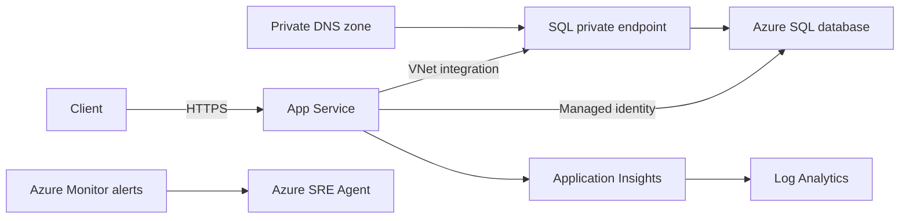

# Contoso Ticketing Architecture

## Workload

Contoso Ticketing is a .NET 8 minimal API on Linux App Service. The supported routes are:

- `/healthz`: process liveness; does not query SQL.
- `/readyz`: opens a SQL connection and executes `SELECT 1`.
- `/api/tickets`: reads `dbo.Tickets` through a parameterised query.

## Dependencies

SQL public network access is disabled. The app resolves the SQL hostname through
`privatelink.database.windows.net` and reaches it through the private endpoint. Authentication is
passwordless, but the App Service identity still needs a contained database user and
`db_datareader`; only the configured Entra SQL administrator can establish that initial
authorization.

## Desired-state ownership

- `infra/main.bicep` composes all Azure resources.
- `infra/modules/` owns network, database, web, monitoring, and alert configuration.
- `docs/desired-state.md` contains live verification and reconciliation commands.
- `docs/operations-runbook.md` owns the private SQL bootstrap procedure.

Never remediate an incident by enabling SQL public access, adding a password, weakening TLS/HTTPS,
removing the NSG deny rule, or committing runtime drift.
